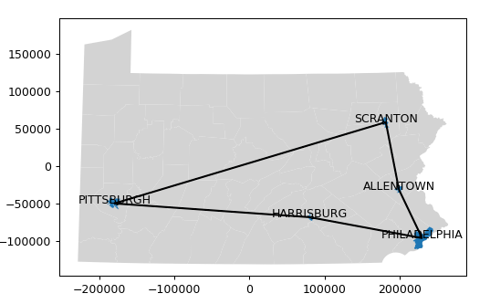

### Working With Maps

In this assignment we make a weather map and estimate
some travel distances.  This should all be done in one Jupyter
Notebook based on our 'generic' venv.


### Step 1: Imports and data

You will need:
```
%matplotlib notebook
import numpy as np
import matplotlib.pyplot as plt
import pandas as pd
import geopandas as gpd
from pyproj import CRS
from geopy.geocoders import Nominatim
```


### Step 2: Datasets

You will need to read the following datasets in to Pandas DataFrames:
* snowstorm_PA.tsv
* PA_cities_counties.tsv
This will give you weather data for the snowstorm of Jan 16 2022.
Remember to use ```sep='\t'``` in your ```pd.read_csv``` commands.


You will need to read the following shapefiles into GeoPandas GeoDataFrames:
* tl_2021_us_county.shp
* PaMunicipalities2022_01.shp

These are available on Canvas, to avoid problems with large binary
files on github.


### Step 3: Copy in some utilities

Copy in the following functions from the *geopandas_experiments.ipynb*
notebook, for convenience:
* add_area_and_label_coords()
* plot_with_labels()
* calc_overall_centroid()
* haversine_np()  (from the lecture notes)


### Step 4: Set up an ortho projection for PA

Select the geometry for Pennsylvania from the GeoDataFrame.  The
FIPS code for PA is 42.

Set up an orthographic projection for PA, just as we did in
*geopandas_experiments.ipynb*.  Set the CRS for the GeoDataFrame.


### Step 5: Estimate some county-wide snowfall numbers

We are interested in the 'Expected Snowfall' values from the
snowfall dataset.  However, we only have that data for cities,
and we need to plot by counties.  You can get averages for
counties by:


* Merge the snowfall dataframe with the cities-and-counties dataframe,
using the city name as the merge key.  Note that there are many cities
for which we have no snowfall estimate, so there will be a lot of
missing snowfall data.


* Rather than give up
  on those cities, you can use the Nominatim geocoder to get county
  information for most of them, as follows.
 * Use the geocoder to look up `{Location} Pennsylvania US` , where
   {Location} is that entry in a particular row.
 * Convert the result to a string.  Almost all of them are of the
   format: "Some City, CountyName County, ..."


 * Use the Python string _split_ method to separate that string at
   the commas.  Find the substring that contains the word 'County'.
   Separate off the first word of that substring.  That word will
   be the county name.


* Insert those county names in the dataframe where they are needed.  Some
  may still be empty, but most cities will now have county information.
* Prune the resulting dataframe down to only the columns you need.


* Group the dataframe by county and take the mean.  This will handle
counties with more than one named city by averaging over their
snowfall estimates.

Now you should have a dataframe with county names and estimated
snowfall values.


### Step 6: Merge the snowfall data into the GeoDataFrame

Be careful to do the merge in such a way that counties with no
snowfall data stay in the GeoDataFrame, but with 'NaN' values
for 'Estimated Snowfall'.  We want to use those records to draw
the counties outside the snowstorm area.


### Step 7: Plot the snowfall map

The GeoPandas page for
[Mapping and Plotting](https://geopandas.org/en/stable/docs/user_guide/mapping.html)
describes how to handle missing data.  Use those features to make
sure the part of Pennsylvania the snowstorm missed appears in the
map!

Pick a color map and 'missing' color that looks reasonable to you.


### Step 8: Travel distances

Consider a travel loop that includes these Pennsylvania cities:
```
travel_towns = ['Pittsburgh',
                'Scranton',
		'Allentown',
		'Philadelphia',
		'Harrisburg',
		'Pittsburgh']
```
The _PaMunicipalities2022_01.shp_ shapefile provides geodata for
those cities, among others.


Read in the shapefile.  If you check its CRS you will find that it
uses a pseudo-Mercator projection, not regular longitude and latitude.

Create versions with CRS given by your
orthogonal projection and by a _Platte Carree_ projection.  You can
create the _Platte Carree_ projection based on its EPSG number,
which is 4326.  Add area and label coordinates to both GeoDataFrames.


### Step 9: Travel Map

Plot the travel cities on a map of PA in the ortho coordinate system. You
can do this just by overlaying the plots of the full PA geometry and the
subset of the cities geometry containing only the four cities- the Jupyter
Notebook with draw them together if they are created in the same block.

You can use the "color='colorname'" keyword argument to make their colors
distinguishable.


Add arrows to the map showing the travel steps.  You can use the
representative_point() method, or the 'coords' attribute we defined
from it.  Your map should end up looking something like this:



### Step 10: Loop Travel Distances

Calculate the total straight-line travel distance around the loop
using the GeoSeries.distance() function in our ortho projection.

Calculate it again using the haversine distance in the _Platte Carree_
projection.  What are some reasons why the values differ?