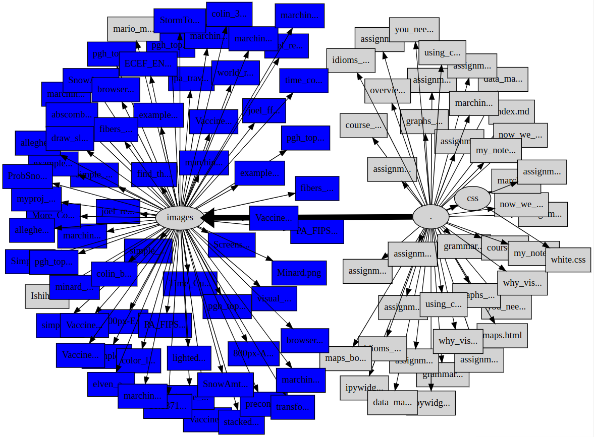

### Working with Graphviz

In this assignment, we take a simple directory tree as an example graph.
You generate a Dot language representation of the tree, subject to some
rules about node coloring and shape.  You render the Dot with an appropriate
choice of Graphviz layout engine, and turn in the notebook and the resulting
graph.

#### Step 1: Set up some code to traverse the directory tree

The directory we will graph will be the 'docs' directory of this
github repository.  You probably have a clone of the repo on your laptop
to access the data files and notebooks we have used in the course, so
it should be handy.

Start with the *graphviz_assignment_skeleton* notebook.  I wrote the
skeleton code to traverse the directory
tree using *os.path.walk()*, but feel free to use *pathlib.Path()* instead.

#### Step 2: Fix the missing parts of the code.

Start by getting the following parts working:
* *get_label* should take a full-length filename and return a short
  version.  Return the full name if it is 10 characters or fewer, or
  the first seven characters plus '...' if it is longer than that.
* *get_rel_paths* should return the relative paths to the parent
  directory and the current file.  For example, given '/foo/bar/baz/blrfl'
  and '/foo/bar' it should return 'baz' and 'baz/blrfl'

At this point the program should actually run.

#### Step 3: Fix *add_descendant_to_all_ancestors()*

This function just increments the descendant_count for the node on which
it is called, and every parent node.  Make it do so.

#### Step 4: Restrict the leaf nodes that get drawn

Modify *show_this_leaf* to avoid drawing leaf nodes with names beginning
with '.' or '_' .  I added code to my version to exclude editor backup
files with names like "something~" and "#something#" as well.

#### Step 5: Add features

Modify the Dot being written so that:
* leaf nodes are drawn as rectangles, while other nodes are ellipses.
* filenames ending in '.png', '.jpg', or '.svg' are filled with blue,
  while other nodes are filled with light gray.

#### Step 7: Another feature

Modify the Dot being written so that:
* The width of the edges is proportional to the square root of the
  number of descendants below that edge.  The attribute you want here
  is *penwidth*.  Empirically, there are many cases where scaling the
  size of a graphical object by the square root works much better than
  strict proportionality.

Feel free to add any other visual enhancements you like.

#### Step 8: Render the graph and hand everything in

Copy and paste your Dot code into our Graphviz test app, or just render
it directly from the command line.  Find a layout engine that gives a
reasonable result and capture a screen shot of the graph.

My version looked like this: 

Hand in the working jupyter notebook and the screen shot.

