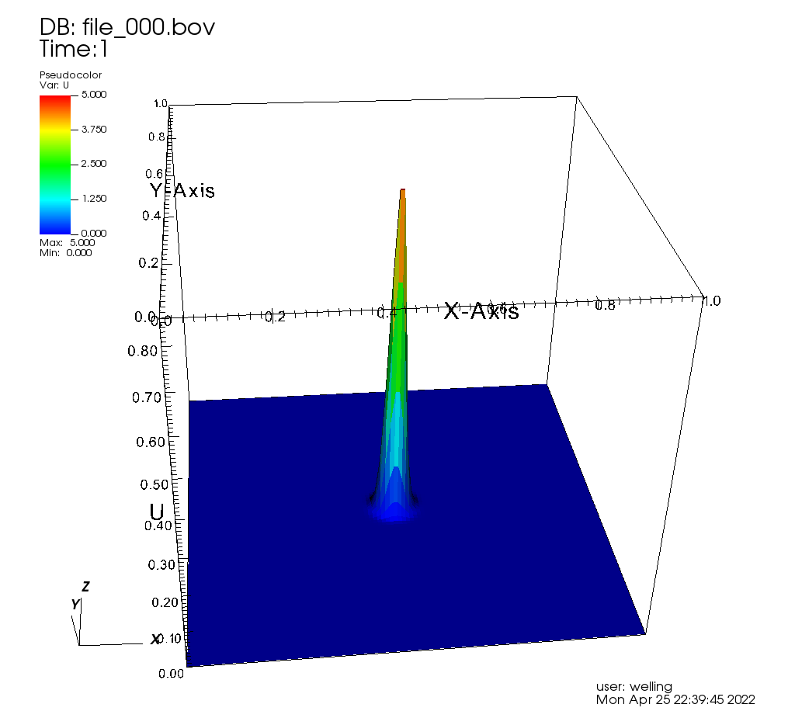

# Make An Animation With VisIt

In this simple assignment, we generate some data frames using a
Jupyter notebook and then generate an animation from the frames
using VisIt.

### Step 1: Generate Data

There is a Jupyter notebook called *movie_frame_generator.ipynb* in the
notebooks subdirectory of the course Github repo.  (You may have to use
a "git pull" command to make it appear in your clone of the repo).  Run
that notebook.

This should produce a directory called 'frames' beneath the notebooks
directory, and in that directory a set of numbered files with the
extensions '.bov' and '.doubles' should appear.  These make up the
frames of an animation.

It's actually the evolution of a 2D scalar wave equation.  It will behave
like a perfect rubber sheet.  The simulation starts with a piece of the
sheet pulled up in the middle.  As time passes, the sheet snaps back and
a wave travels out to the edge.  There should be about 50 frames in all.

### Step 2: Load the data into VisIt

Start up VisIt, and select 'Open File' to load the data.  In the file
selection dialog, set 'File grouping' to 'smart'.  If you look in the
'notebooks/frames' directory you should see 'file_*.bov database'.
Select that to load the whole time evolution into VisIt as a time series.

### Step 3: Build a visualization of the data

'Add' a 'pseudocolor' plot of the variable U, which is the height of the
simulated sheet at any given time.  Click 'Draw' to see a 2D color image
plot of the first time step of the data.  At this point you can adjust the
time slider to see any of the data time points.

Under 'Operators', select 'Transforms', then 'Elevate'.  That will change
our 2D plot into a 3D plot with the U variable defining the height of
the sheet.  Click 'Draw' again to show the 3D form.

By dragging in the drawing window, rotate the object to give a better view.

As shown in class, click through to the controls for the 'Elevate' operator
and set 'Scale Elevation Height' to 'Always'.  Click 'Apply' to save that
setting, then click 'Draw' again.

The 'time=0' view of the data should look something like this: 

At this point, you should have a good view of the data.  You can move the
time slider to see any time point, or click the 'Play' arrow to cycle through
your data as an on-screen animation.

### Step 4: Create a movie file

Depending on your laptop operating system, this is the step most likely
to cause problems.  See 'remedies' below if things don't go smoothly.

Under the 'File' menu, select 'Save movie'.  Select 'New simple movie'.
On the 'Choose format' screen, just click the '->' button to specify that
you want to make an MPEG movie with the current resolution.

You can use all the defaults for "Choose length" and for 'Choose
filename', and you probably won't need to be notified by email when
the movie is complete.  For 'Choose method', just leave it with 'Now,
use currently allocated processors'.  Click 'Finish', and it should
start work on your movie.  The whole process should only take a couple
of minutes.

#### Remedies for possible problems

On Linux, everything is likely to go as described.  An open source MPEG
encoder will be used to generate your movie.  On a Mac or a Windows machine
there may not be an open source MPEG encoder, so the actual making of the
movie can fail.

First, try producing the movie in a Format that is native to your machine.
Mac users should try AVI, MPEG 4, or QuickTime.  Windows users who are
unable to make an MPEG movie may try WMV format.

For Mac users, there is a document on the assignment's Canvas page
describing a method some Mac users have had success with in past years.

The ultimate work-around for movie-making problems is to select
a 'Format' of 'PNG images' for your movie, make a .zip file of the .png
files that are produced, and submit that .zip file as your homework solution.
