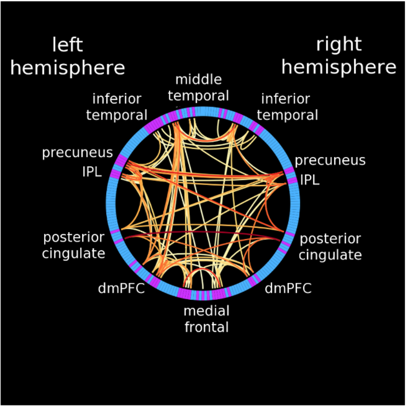

# Welcome to 38612 #
## Information Visualization for Data Scientists ##

## Instructor: ##
Joel Welling
welling@psc.edu

Office hours are by appointment for now, by Zoom or in person (here in 300 SC room 315).

## Equipment ##
Do you have a laptop or equivalent?
* Linux?
* Windows?
* Mac?

Can you write code on it?

Any assignment I give *can* be done on your Bridges2 accounts, but
it's entirely appropriate (and maybe easier) to do it on your laptop.

## Reality Checks ##
I'm assuming that:
* Everyone can write and run Python 3
* Everyone can fire up a Jupyter Notebook, and modify it if
necessary.
* Everyone can run a Python program *outside* a Jupiter
Notebook, like on a command line.
* Everyone can edit files.

If you are not comfortable doing any of these things, contact me after
class and we will fix it.

## Other Experience ##

What kinds of data visualization have you done in the past?

What kinds have you seen elsewhere that you were impressed by?

## Data, Idioms, and Manifolds ##

Visualization techniques mostly consist of collections of *idioms* for
mapping data to visual representations.

Any given visualization is built by combining idioms.

Idioms are only applicable to data of particular types.  For example,
a spreadsheet and a fluid dynamics simulation require very different
idioms.  Data exists on *manifolds*, and each idiom is only suitable
for one or a few different manifolds.

## Getting The Data Into The User's Brain ##

Obviously, the best choice of visualization depends on the viewer.
Consider color-blind viewers, for example.

Experience also matters.  Almost everyone can read a bar chart, but
highly skilled users can become proficient with some very complex
idioms.

Brain connectivity, from LaPlante et al. 2014, "The ConnectomeVisualization 
Utility: Software for Visualization of Human Brain Networks"

## Course Plan In A Nutshell ##

We will:
* Talk about the various manifolds on which data can exist
* Look at idioms for each manifold
* ...and the tools that can be used to create them
* Do some programming exercises with those tools
* Spend a bit of time on VisIt, a tool for very large scale
scientific visualization.

This is not intended to be an ordered list.

## Mechanics ##

We have a <a href="https://canvas.cmu.edu/courses/26411/pages/course-intro?module_item_id=4978482" target="_blank">Canvas page</a> for:
* scheduling
* assignments
* homework hand-in, unless otherwise specified

...and a <a href="https://github.com/jswelling/CMU-MS-DAS-Vis-S22" target="_blank">Github page</a> for:
* the lectures (including this one), via <a href="https://jswelling.github.io/CMU-MS-DAS-Vis-S22/" target="_blank">"github pages"</a>
* source code and data
* maybe group projects

## Homework Policy ##

Let's take a moment to look at the [syllabus](https://canvas.cmu.edu/courses/26411/assignments/syllabus) sections on Evaluation and Late Homework.