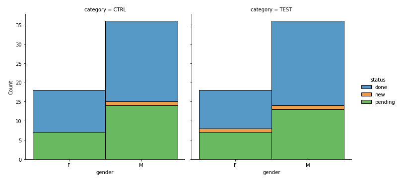
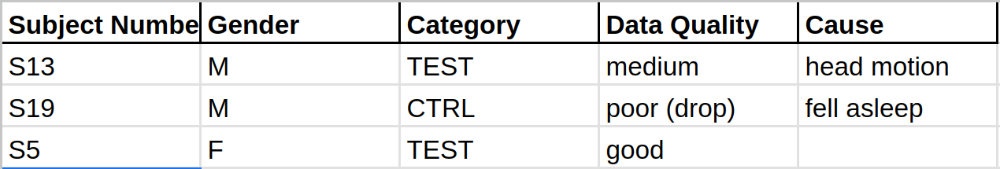
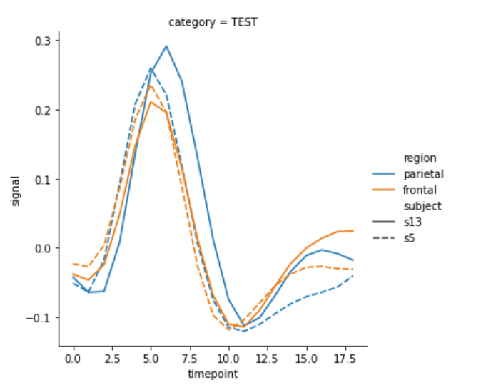
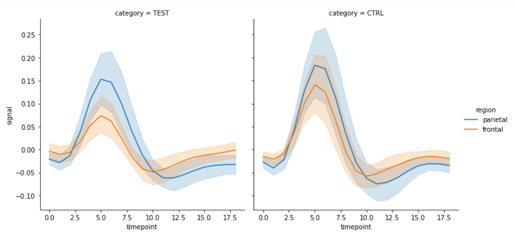

# Some Thoughts On Dashboards

What's a *dashboard*?  In the context of visualization, it's a summary.

You've heard Tableau displays described as dashboards when they show a lot of intercconnected views
of the same information.

You'll hear a short description by Prof. Barber describing a dashboard as something the boss looks
at as sort of an ongoing status report.

Here's a different model.  When you work on a long term project, the people on your team need to
track overall progress.  Let's talk about it in that context.

## Imagine you work on a research project

It will go on for months or years, and there a big team.  Every week or two, there is a meeting
in which all the leaders get together for a status check.

This is the rhythm of things in real projects.

The 'dashboard' here is the visualization you prepare to update the team on the week's news.

You are the team's data scientist.  The project is accumulating data, and each week's data
(hopefully) improves knowledge of the thing being studied.  But some experiments don't work,
and in any given week you make only a little progress on the overall data analysis.

## What do you show your team?

* It has a standard form, to avoid explaining things again and again.
* It describes some new data in the context of previous data.
* It tells the group what they need to know to decide on the next steps.

I've written *this* kind of dashboard several times.

## An important rule of thumb:
* You are the only person who sees 90% of the vis you do.
* Of the remaining 10%, 90% is for your group.
* 1% of the time, the visualization will be shown to the world in a paper or at a conference.

The 'dashboard' is part of the ~10% that is shown to your group.

## Example: A fMRI brain imaging experiment.
* Over the course of a year, maybe 100 subjects get scanned.
* Male and female, test and control.
 * (Probably all are right handed!)
 * For the project I was on, test and control were 'Concussed' and 'Recovered'
* A few scans each week.
* Some subjects drop out, some scans fail.

### Guiding questions
The research group needs to know how the overall project is proceeding, and if anything unexpected
happened with this most recent set of subjects.

How do these subjects fit in to the larger group?
* What fraction of the total subjects do they represent?
* Are they 'typical', or do they differ somehow?

How does the data look?
* What fraction had to be discarded, and (briefly) why?
* Were these experiments atypical in any way?

Sometimes the scanner doesn't work properly, sometimes the subjects fall asleep.
Bar charts or a table here?

* What do the in-group results look like?

* How do they fit with the overall results?

For this fMRI experiment, this might be activation maps or charts of activation by brain area.

### The New Subjects

### In Context

### What Not To Show

Some data should not appear at the top level.  People may want to *drill down* to see the details
in some cases.

An fMRI example: curves of head motion tracking.  Uncorrected head motion leads to bad data,
so people want to see the curves- but not at the top level.

Fancy controls and interface elements should probably not be used.
* They take up space.
* They are great to look at the first few times, but by the 10th or 20th meeting they are annoying.

If your group has a logo, show it but keep it small.  Everybody already knows what group
meeting they are in!

### In Summary...

What you show to your group (every week for maybe years!) should be:
* Informative but not distracting
* Uncluttered
* Built out of parts that obey the visualization principles we've learned.

Here is Rebecca Barber's presentation on dashboards.  She speaks in the context of the boss rather
than the research group, but the principles are the same.

[Becky Barber on dashboards](https://www.youtube.com/watch?v=gCChe_ACBio)