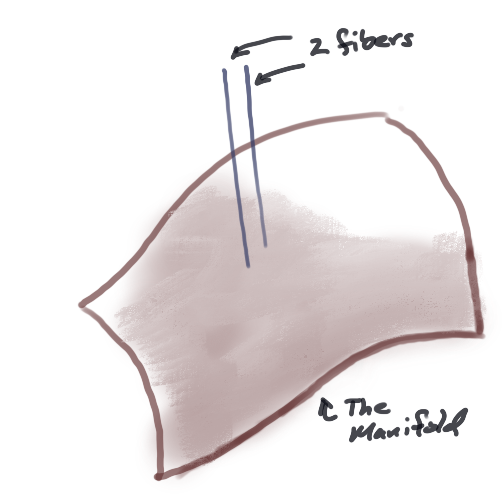
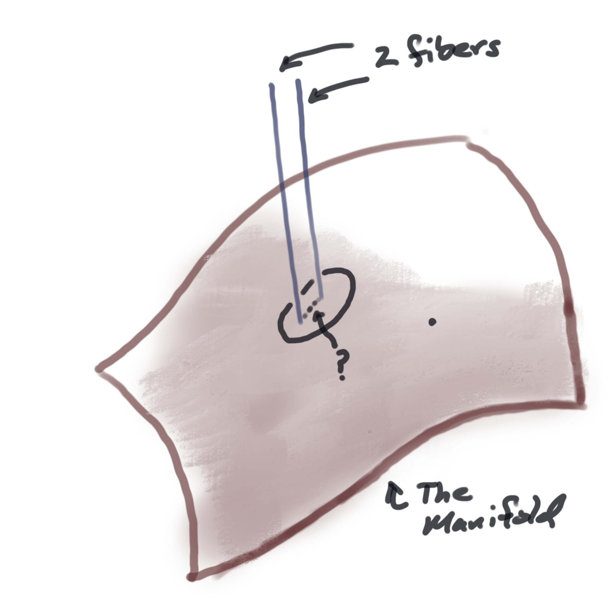
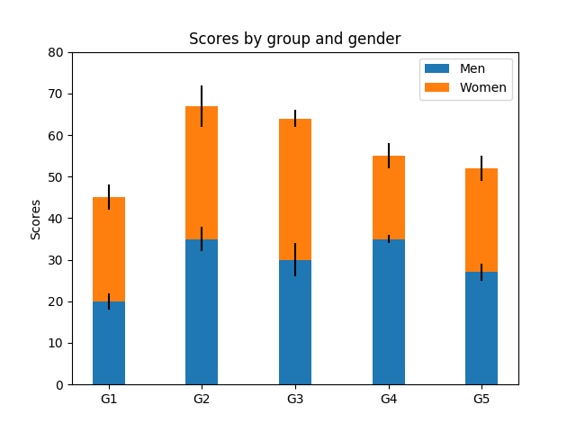
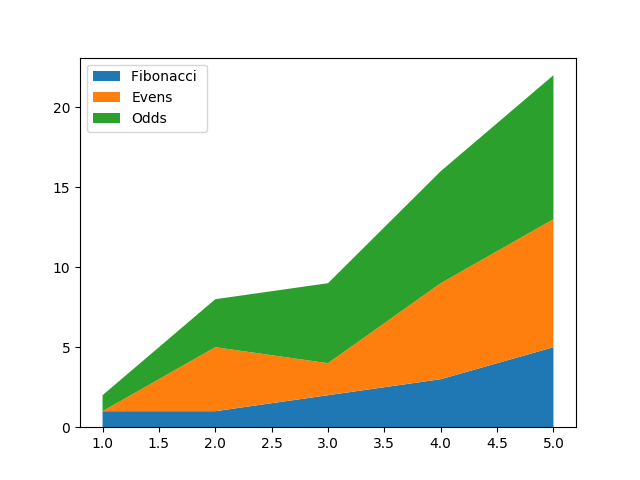
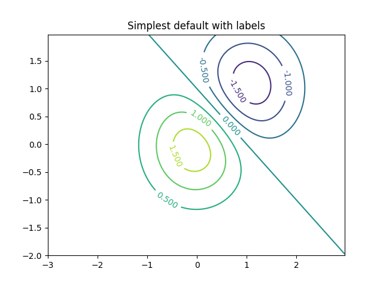
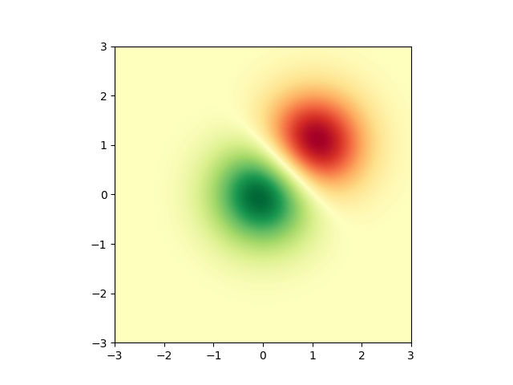
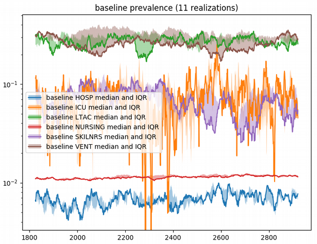
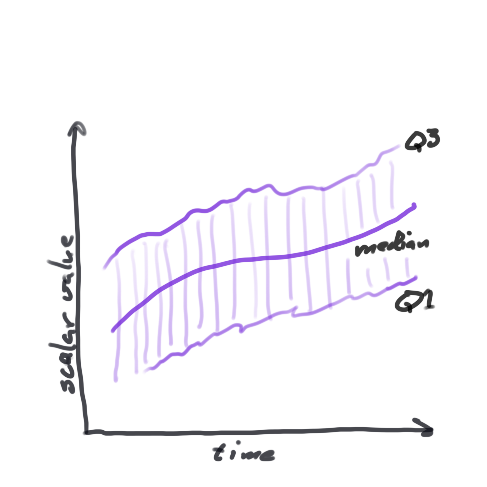
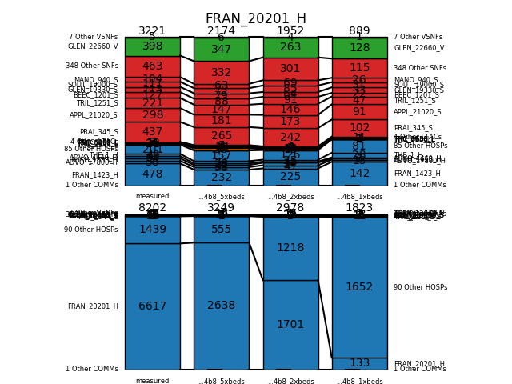

## Data Lives On Manifolds

Why do we care?  Because visualization uses *idioms* and the choice of
idiom depends on the type of data.

This Idea Comes From Fiber Bundle Theory

The **Manifold** is the space within which the data exists.
* It might be 2D, like a map
* It might be 3D, like some physical space
* It might be 0D, like entries in a spreadsheet

The **Fiber** is the data.
* It might be a simple scalar, like depth of snow or the temperature of
a material.
* It might be a vector, like a velocity.
* It might be a collection of scalars, like the columns of a spreadsheet row.
* It might be text, like the name of a city or county.

But Are The Fiber Values Continuous?

The values on the fibers may vary continuously, or they may not.
* Snow depth would be a simple continuous scalar
* The name of a county on a map is not continuous, and can't be interpolated.

## Manifolds and Fibers Restrict The Idiom
A particular visual idiom is applicable to a particular type of fiber on a particular type of manifold.

We'll use this to lend some order to the zoo of idioms we're considering.

## Some familiar idioms

 

The manifold is discontinuous, like a spreadsheet.  Each fiber has multiple
scalar values, which get stacked.  These scalars have error bars.

 

This manifold is 1D continuous.  The fibers contain 3 scalars, which
we treat as continuous real values.

 

This is a 2D continuous manifold.  Each fiber contains a single real-valued
scalar. We can take derivatives in either direction.

 

Same as the previous example.  This is a different idiom for the same types
of manifold and fiber.

## VTK File Formats
An Example From 3D Scientific Vis

[VTK File Format Image](https://github.com/Kitware/vtk-examples/blob/gh-pages/src/Testing/Baseline/Cxx/GeometricObjects/TestLinearCellDemo.png?raw=true)

See how the data types map to manifold and fiber types?

## Combinations of idioms build complexity

 

The manifold is 1D, continuous time.  The scalars are statistical quantities.
We use three curves per scalar to show how the median and IQR vary over time.

This data comes from the time course of (simulated) MRSA infections at a set
of health care facilities.  Multiple simulations were run, and each simulation
provides one time course per facility type.

The graph was drawn with matplotlib.

At each time point we have a collection of statistical samples.  By reducing
the distribution at each time to a summary (Q1, median, Q3) we can map it to
a known idiom for multiple simple scalars on a 1D manifold.

At each time point, a collection of statistical samples. 

## Comparing Patient Flow With Linked Stacked Bars

The data are a set of lists of numbers.  Each set shows the number of
patients that transferred to and from each of several health care facilities
to a particular facility (FRAN_20201_H is a hospital).

There are several such sets- measured "ground truth" and several simulation runs
that we want to compare to ground truth.

For each set, the manifold is discontinuous and 0-dimensional.  The fiber is
a list of integers, one per originating health care facility.  This is a
good match for a stacked bar chart.

We do two stacked charts, one for arrivals and one for departures.

How to relate the different sets (two stacked bar charts each)?  We draw them
side-by-side, with connecting lines to help the visual flow.  So now we are
using two "layers" of visual idioms.

This was done with matplotlib.