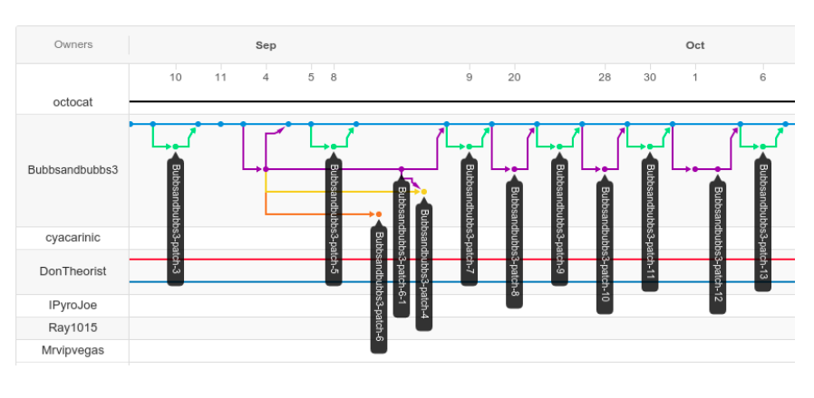
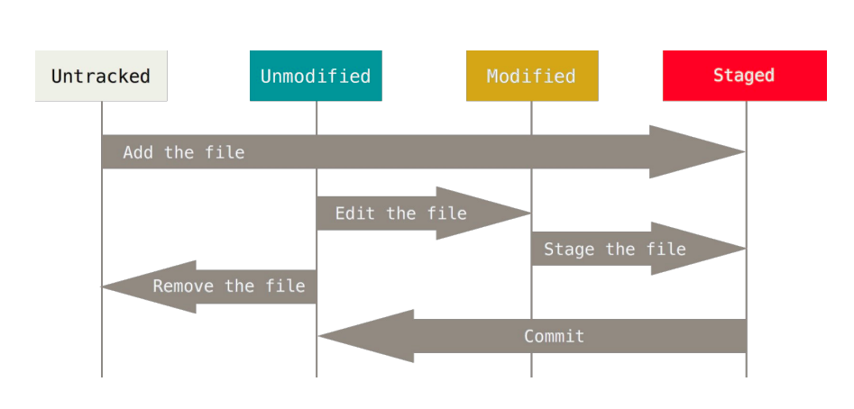

# Version Control, Git, and GitHub


## Why are we doing this?

* Because everone does version control.  Learning some good tools makes life easier.
* Because people in data science jobs spend a *lot* of time doing this.
* Because GitHub is the biggest and most popular repository of open source tools out there.
* Because the resources for this class are on GitHub too.


## Why Version Control?

* Because life without it quickly becomes a nightmare.
* Because science gets done in teams, and you don't want to mess up your team.
* Because writing papers involves making little side trips in the code (branches).
* Because bugs will happen, and you need to find where they were introduced.
 * Ideally there are also regression tests, but that's not for today.


## Also, *Provenance*

The provenance of data is the history of where
it came from, and how to reproduce it.

Good science requires good provenance! (And
publishing papers without going crazy does
too).

Part of the provenance of data is the _exact_ code
used to generate/process it, so version
control is a critical part of provenance.


## A Little History
Well, *my* history anyway.

Stage 1: "I just keep copies of my old code".

Stage 2: Revision Control System (circa 1982).
Pretty much like stage 1.

Stage 3: Concurrent Versions System (1986).
Scripts on top of RCS

Stage 4: Subversion (or SVN, 2000)

Stage 5: Git


## Is Git The Answer?

Well, it's the dominant answer _for now_.

There are competitors, like [Mercurial](https://www.mercurial-scm.org/).

Git is also still gaining new features.  We'll have to wait and see.


## Git can be confusing when you're not used to it
[](https://xkcd.com/1597/)


## There are lots of docs and tutorials available

So many that I'm not even going to list them.


## Things To Remember When Reading Tutorials

Git has a lot of potential patterns of use
(unfortunately). Which one is the tutorial
describing?

Remember that there can be *lots* of live
branches in your personal local repo. Your
actual code directory only shows one of them.
Changing branches will change which code is visible.


# Git and GitHub

GitHub is a very popular web host for open-source code.  It *uses* git,
but so do many other places.  Git came out of the Linux project and predates GitHub.

Some other sites that use git:
* [GitLab](https://about.gitlab.com/)
* [BitBucket](https://bitbucket.org/product/)  (now owned by Atlassian)

We host our class on GitHub because of history, and because they do a good job.


# Order Of Discussion
1. Big features of the architecture
2. Setting up a repo
3. Editing within the repo
4. Sharing your code
 * With your group
 * With a primary developer


We'll work through the necessary ideas and commands,
and then we'll try it all out on our test repo.


## Order Of Discussion
1. Big features of the architecture
 * It's all about a connected graph of commits.
 * The graph can have remote connections (more on this later).
 * Your source files only show one node at a time, but your git environment knows all the nodes and can switch back and forth.
 * Files need to be added to the index before they can be committed.


## A Network Of Commits




## Git has an "Indexed" State




## Managing Indexed State

To add a file to the index (stage it):
```
git add <filename>
```
To remove an already-indexed file:
```
git rm <filename>
```
To revert to the node you were editing, undoing your add:
```
git reset <filename>
```


To check what's what:
```
git status
```
We will talk about using the `git commit` command shortly...


## Order Of Discussion
1. ...
2. Setting up a repo

To clone this class:
```
git clone https://github.com/jswelling/CMU-MS-DAS-Vis-S24
```
To create a local repo with no GitHub partner:
```
git init
```
To see what repos your clone is connected with:
```
git remote -v
```


## Order Of Discussion
1. ...
2. ...
3. Editing within the repo

Suppose you've edited a file and used `git add` to put the chenged file in the Indexed/Staged state.

To turn your indexed files into a node on your local graph:
```
git commit
```


This will open an annoying editor window for your *commit message*.  You can avoid that by
including the message on the command line:
```
git commit -m "This is my commit message"
```
After your commit, you can jump to any branch or node with:
```
git checkout <branch-or-node-hash>
```


## Order Of Discussion
1. ...
2. ...
3. ...
4. Sharing Your Code

We already learned that `git clone` connects you to a remote *origin* repo.


To get any recent changes from *upstream* (your remote origin):
```
git pull
```
* This is equivalent to `git fetch` plus `git merge`.
* It may produce *merge conflicts* which you will have to *resolve*.


To send your changes to your remote origin:
```
git push
```
But your request to push may be refused if:
* you don't have the most recent updates. (use `git pull`.)
* you don't have permission. (check to see if you can write to the remote origin.)
* some conflict arises with the graph. (stay calm, get some coffee, and think.)


## Other Useful Commands

```
git branch  # tells you what branch you are on

git merge <branch>  # explicitly merge two branches

git diff --stat

git diff

git log --graph

git rebase  # loved by many, but not by me

git bisect  # for locating bugs!
```


You can change the editor which git opens with:
```
git config --global core.editor emacs
```


# Experiments!

Now we try all of these things out.


## Preliminaries

* Accept the invitation to join the repo
 [CMU-MS-DAS-Vis-S24-GITCLASS](https://github.com/jswelling/CMU-MS-DAS-Vis-S24-GITCLASS)
 if you have not already done so.
* Clone that repo. Unless you have a shared ssh key with GitHub, use the '''https://''' form
 to make the clone.


* To push changes to the repo without a shared ssh key, you will need a GitHub personal access token.
Follow along with the instructor for the steps to create one.
 * If you lose it, you will have to create a new one!
 * Whenever git asks for a password, paste in this token instead.
 * When you paste it in, it won't be visible because it's working like a password and thus is hidden.
  Don't paste it twice!


## Pick a Branch

The repo has a main branch, and several other branches with names like **group_1**, **group_2**, etc.

Everyone is going to be assigned to a group.  Each member of the group should check out that group's
branch.  For example,
```
checkout group_2
```


## Edit helloworld.py

Change the code in src/helloworld/helloworld.py so that it includes your name.  Then push your
change back to the branch on GitHub.  The steps are something like:
```
cd src/helloworld
<edit the file helloworld.py to add your name>
git add helloworld.py
git commit -m "added my name"
git push
```


## This will probably fail!

When you try to push your changes, git will probably tell you that you don't have the most recent
version of the branch.  This is because someone else in your group got their change committed first!

You will need to do a `git pull` to get their change.  This will report a *merge conflict*, which
you must resolve.


We'll walk through this in class, but the basic steps are:
```
<edit helloworld.py to fix the conflicted area>
<save your edits>
git add helloworld.py
git commit -m "resolve merge conflict"
```
After that your `git push` should work, unless another member of your group did it first!


## Pull Requests

Once all groups have updated their branches, we will work through the process of merging
all the branches back into the *main* branch using pull requests.  Please follow along,
because this is the way it is usually done in real work environments.


