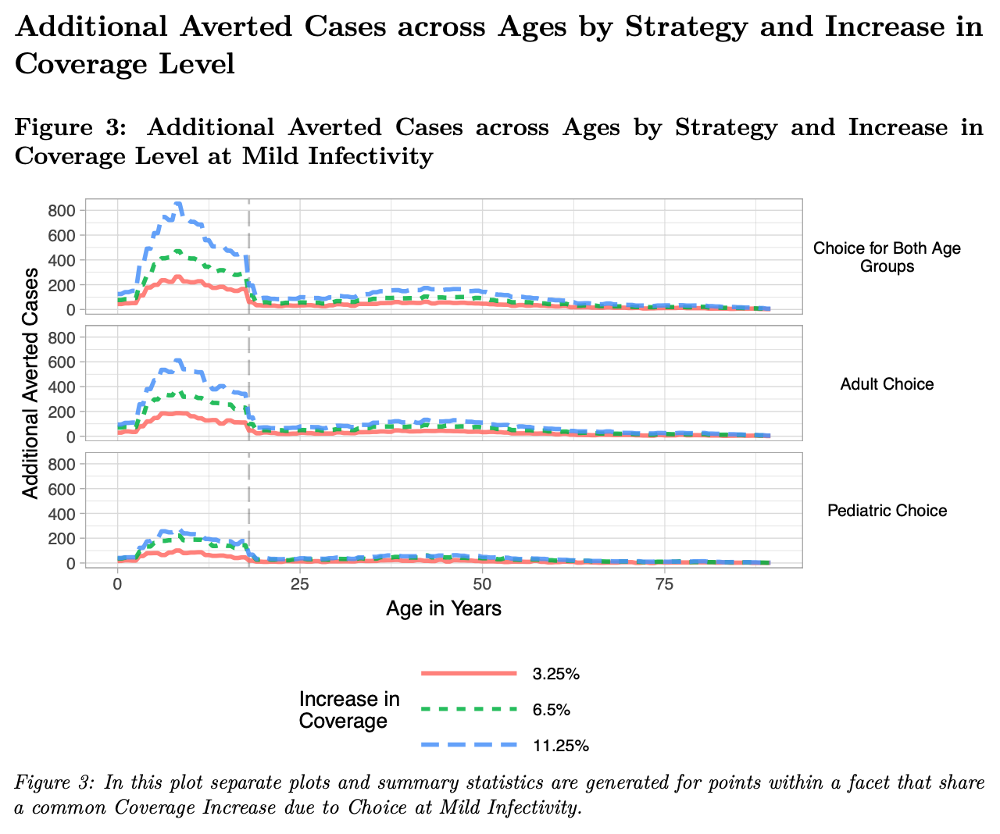
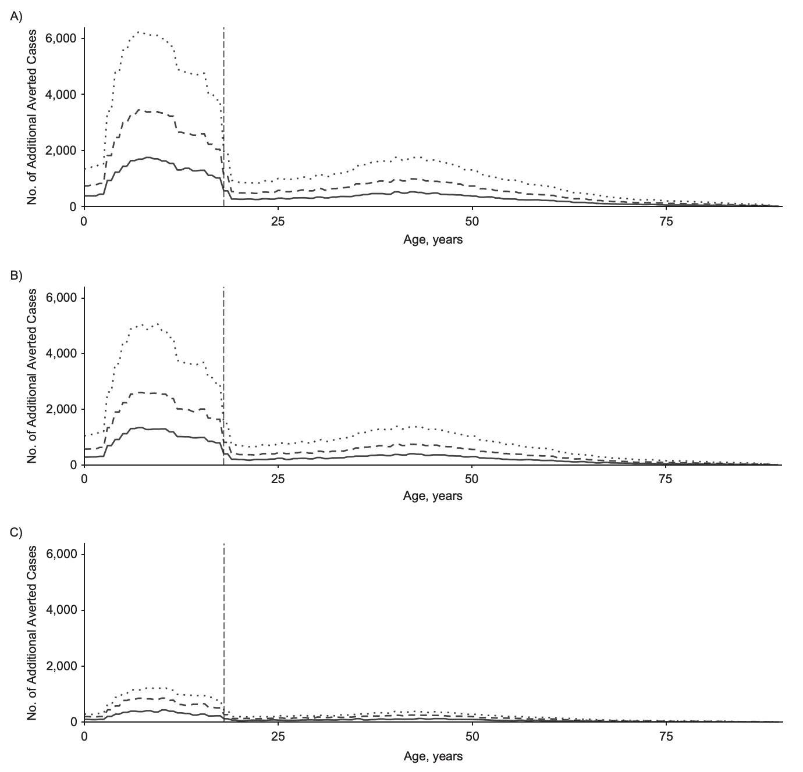
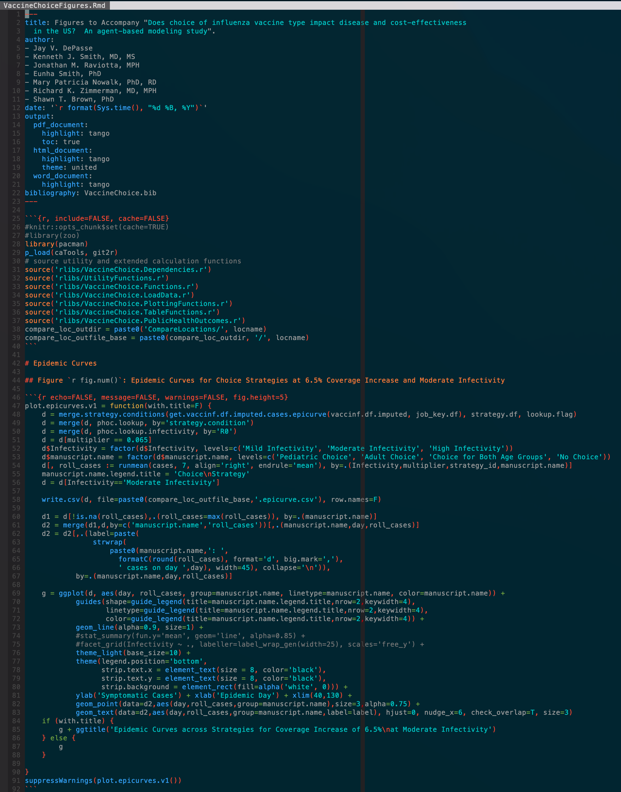
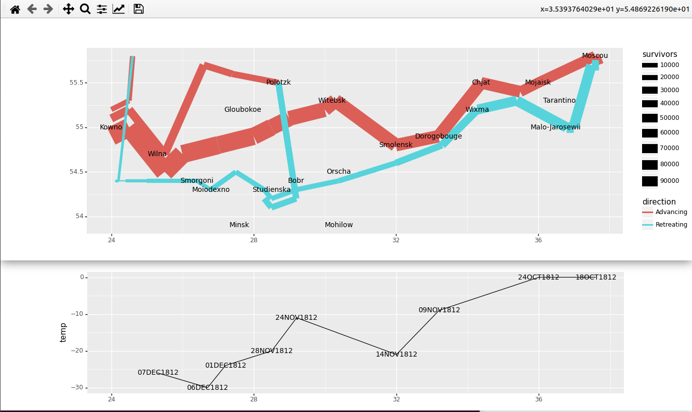

## The Grammar Of Graphics

... is an attempt to impose some structure on visualization, to make it
more than just a collection of subroutine calls and idioms.  It's been
through a few iterations, beginning with
[Graph-Theoretic Scagnostics](https://www.semanticscholar.org/paper/Graph-theoretic-scagnostics-Wilkinson-Anand/8bc9868fe6c936614f7f94b01757723e9ffaaa43)
by Wilkinson, Anand, and Grossman in 2005.

This led to a famous book, **The Grammar of Graphics**, by Leland Wilkinson.

This led to
[A Layered Grammar of Graphics](http://vita.had.co.nz/papers/layered-grammar.pdf)
by Hadley Wickham 
([reference](http://vita.had.co.nz/papers/layered-grammar.html)).  This is
basically a restructuring of Wilkinson's grammar.

There is a full book version:
[ggplot2: Elegant Graphics for Data Analysis](https://books.google.com/books/about/Ggplot2.html?id=bes-AAAAQBAJ&source=kp_book_description)

These were implemented in **R**, the programming language.  As a result,
this formalism isn't very Pythonic.  To translate to Python, one must
choose between Pythonic design and pure preservation of the grammar.

Today we have a guest presentation by Jay DePasse, my former boss (before moving on
to more sensible jobs) and a true master of R and ggplot.  It's a beautiful implementation
and a very flexible tool, but I can't do it justice.  Here's Jay.

# R

R is a programming language for statistical computing with a long history,
starting with an open-source implementation of `S` some 25 years ago.

# Good R

* Many, many packages for stats, optimization, machine learning, and more
* Efficient implementations in C, C++, Fortran, etc.
* Intuitive syntax for vectors, arrays, data frames
* Great support for visualization: `ggplot2`
* Interactive graphical environment through either `RStudio` or `jupyter notebooks`

# Bad R

* R OOP has **three** alternative class systems!
* Inefficient/awkward program flow control
* Painful text manipulation
* Not as widely popular as python; packages for tasks outside of stats can be spotty or unavailable
* Indexing begins with **1**

# Essential Libraries

* `tidyverse` - Project by [Hadley Wickham](https://hadley.nz/) provides a very thoughtful and well-designed set of tools (including ggplot2).
* `data.table` - A very efficient and powerful library built on top of R's dataframes; fast, succinct, compact, maybe just a little arcane.  [data.table](https://cran.r-project.org/web/packages/data.table/vignettes/datatable-intro.html)
* `knitr` - Dynamic report generation with better control and more polished output than jupyter notebooks [knitr](https://github.com/yihui/knitr)

# ggplot2

"system for declaratively creating graphics, based on The Grammar of Graphics. You provide the data, tell ggplot2 how to map variables to aesthetics, what graphical primitives to use, and it takes care of the details"

Purists argue for the underpinning philosophy of visualization based on the rigorous grammar of graphics.

In practice, you don't have to engage in the theory explicitly to take advantage of its flexibility and simplicity.

ggplot is over 10 years old and has over 100 registered [extensions](https://exts.ggplot2.tidyverse.org/gallery/)

# ggplot2: Practical Strengths

* multivariate data visualization: easily swap variables and visualize using color, shape, facet grid, line style, and so on (without changing the data itself)
* **themes**: change overall plot appearance (font, background color, labels, legends, etc) by selecting different themes
* summary statistics including regression, curve fitting, rolling averages... 
* very readable plotting code

# Publication Cycle

Being able to make nice-looking plots isn't enough - you need to be able to effectively share and maintain both your code and the resulting plots

In both academia and industry you have to collaborate with others, make frequent (and urgent) modifications, and be able to explain and support your work

Not nearly as simple as `collect data -> create visualization -> publish`

`collect data -> create visualizations -> make changes based on co-authors' demands -> submit -> wait -> realize data contains errors, fix -> redo visualizations -> submit again -> wait more -> forget everthing -> respond to reviewer demands -> repeat...` 

`...realize journal charges extra for color prints -> ...`

# Literate Programming

Knuth suggests [literate programming](https://en.wikipedia.org/wiki/Literate_programming) as a way to make code reproducible, reliable, accessible, and self-documenting.

* Separate data from plotting code (ggplot)
* Keep text, code, and data together (knitr)
* Version control for data and code (git, git-annex)

# Publication Example

# Development Version

[]

# Publication Version

[]

# Markdown Code

[]

*plotnine* is a Python implementation of ggplot2.  Compare with *seaborn*,
which is similar conceptually but more pythonic.  (More on seaborn later).

# Never Get Involved In A Land War In Asia

By
[Charles Minard  (1781-1870) (Public Domain)](https://en.wikipedia.org/wiki/Charles_Joseph_Minard)

This graphic has become iconic, and the ability to reproduce it is often taken
as a test of a visualization tool.

See [Re-Visions of Minard](https://www.datavis.ca/gallery/re-minard.php)
for many examples.

There is a copy of the necessary data in our data directory.

Attempting Minard's Graphic Using *plotnine* 

plotnine and seaborn are both built on matplotlib

You can use matplotlib routines to modify their output.  This is often
necessary for fine tuning.

