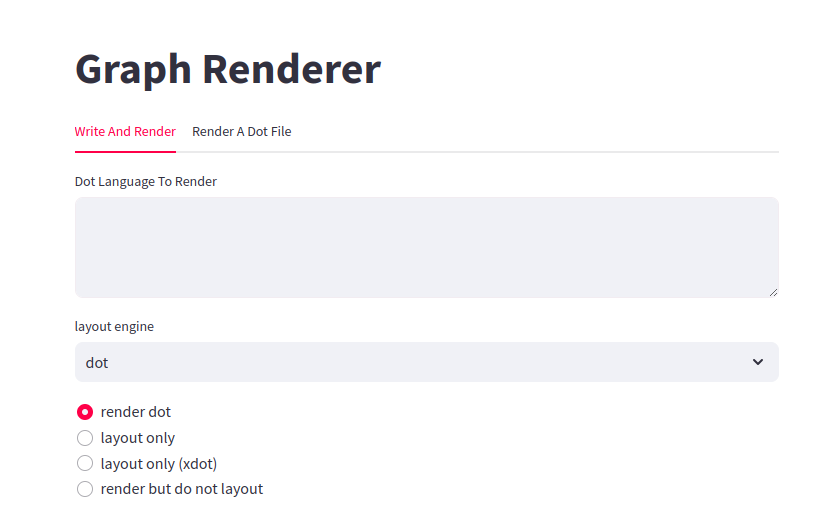

## Graphs - The kind with Nodes and Edges ##

Graphs are ubiquitous in computational work and data science.


I have used graphs for:
* software component descriptions
* analysis workflow descriptions
* patient flow
* transport and logistics
* describing the logistics and provenance of datasets
* constructing an ontology

You too will need to draw complex graphs.


### Types of graphs

A *graph* is any collection of nodes and edges.  Not all nodes must
have edges, but every edge must connect two nodes.<br>


In a *directed graph* or *digraph*, every edge has a beginning and an end.<br>


An *acyclic graph* has no closed loops.  We can make the last graph
acyclic by reversing one edge.<br>


A *tree* always branches out, so that every node has at most one
incoming edge.  One node has zero incoming edges- it is the root of
the tree.<br>


The mathematics of graphs is beautiful and fascinating.  We could talk
about graph centrality and connectedness for an entire course.

But that would not be this course.


### Layout methods

Graph layout is a tricky business, because the display area is 2D.  How to
minimize overlap and crossing of graph edges?

We will be working with [Gephi](https://gephi.org/), a wonderful stand-alone
interactive graph tool.  


We will also be working with [Graphviz](https://graphviz.org/) , an old but
very stable and capable *non-interactive* package.  Because it can
produce such lovely graphs and has a wide selection of *layout engines*,
a lot of the static graphs you see on the web were made with Graphviz.

Someday, you will want to put a really lovely graph in a paper or report.
Graphviz is the way to make that graph.


Tools for laying out graphs interactively in web browsers also exist, in
the form of javascript libraries.  Let's look at an
[example from D3](https://observablehq.com/@d3/force-directed-graph) .


Interactive layout is generally force-directed.

Graphical elements are made to repel eachother, in this case via
javascript interactions.  Note that you may still have to rearrange
elements to get a clear view.


Other interactive layout methods exist, for example grid-based layout.
If the graph is actually a tree, layout becomes a lot simpler.


### Using Our Demo App

Go to your clone of the [CMU-MS-DAS-Vis-Streamlit github repo](https://github.com/jswelling/CMU-MS-DAS-Vis-Streamlit) repo. cd down into the src/webserver directory.


If Graphviz is correctly installed, the following command should work:
```
$ dot -V
dot - graphviz version 2.43.0 (0)
```
That is, the `dot` command should be able to execute and print its version number.


Try the following command line:
```
$ echo 'digraph { a -> b }' | dot -Tpng -otest.png
```
This should create a png file which looks like:


Now we know we can trust Graphviz.  Let's start up the Streamlit
server, which will call Graphviz.
```
$ cd src/webserver  # if you are not already there
$ conda activate streamlitEnv
$ streamlit run graphserver.py
```


The web [http://localhost:8501/](http://localhost:8501/) should now be
available on your local machine:



If things are working, try copying the following simple graph into the "Dot Language
To Render" box:
```
digraph { A -> B -> C -> A }
```
An image of the graph appears!


You can change the layout engine with the selector below. but it won't make a huge
difference with this simple graph.  You can also read larger graphs from a file.


If you can't get the Streamlit app to work, you can still try experiments (and do
the homework) by putting your Dot language examples in a file and using the
Graphviz command line to convert them to graph images.


### More Structure, and Attributes

Note the difference between:
```
digraph { A -> B -> C -> A }
```

and
```
graph { A -- B -- C -- A }
```

It's an error to try to mix the two.


#### There's a lot more syntax

```
digraph {
  "/some/long/name" [label="name" color="red" style="filled" fillcolor="lightgray"];
  "/a/different/name" [label="thing" color="blue"];
  "/some/long/name" -> "/a/different/name"
}
```


#### Edges can have attributes too
```
digraph {
  A;
  B [label="node B"];
  A -> B [color="blue"];
}
```


#### Defaults can be set for the whole graph
```
digraph {
  node [shape=diamond];
  A -> B -> C -> A;
}
```


#### Full list of attributes...

See [the attributes page at graphviz.org](https://graphviz.org/doc/info/attrs.html) .
There are a lot of them.

Also see the excellent set of examples at
[Rene Nyffenegger's page](https://renenyffenegger.ch/notes/tools/Graphviz/examples/index) .


### There are python wrappers for Graphviz...

But they break, or are abandoned.  *gv* was closely tied to the internals
of the Graphviz library, but it is very difficult to find or build now.

It is very sad to write code, then come back in a couple of years and find
that you cannot run it.  Writing simple python wrappers that generate Dot
is almost as easy as using these interfaces, and much more future-proof.


### Layout and rendering are actually separate steps

Try a simple graph, but select *Output DOT with coordinates*.  When you click
*Submit*, what you get back is Dot- but with coordinate info added.  The layout
engine has figured out where to put everything.

Copy the Dot with coordinates back into the input window, select *render to
SVG only (do no layout)*, and click submit.  Presto! The actual image is
rendered.


The *extended layout* option works the same way, but with even more info.

Check the Flask code to see how to do this from the command line


If you specify node coordinates and edges without coordinates, **neato**
will generate edges with nice arcs.  I've used this to generate arc curves
for transit lines to overlay on a map.


There is a javascript engine that can render fully-laid-out Dot.  This is
a nice design pattern- the server runs the layout engine but doesn't have
to generate the SVG or image.  That work gets delegated to the browser.


### There are some large sample graphs

In the examples subdirectory of the CMU-MS-DAS-Vis-Flask repo, you will
find:
* *bridges_network.dot* is the internal network for the old Bridges
  supercomputer.
* *hermes_classes.dot* is a set of class relationships for some code.
* *hospital_transfers.dot* shows patient transfers in a small hospital
  network.
* tinytest_shipping_network.dot is a commodity shipping simulation result.
  Note how nodes get scaled to keep this graph compact.


Try them with different layout engines.  **Note** that some may take a long
time to do the layout, and you will have to zoom out to see the whole graph.


## Guest Lecturer Brendan Honick!

Brendan is a data curator and metadata librarian at the PSC.
From previous work he has a lot of experience with Gephi.

Please welcome Brendan.  This is the part for which we all installed Gephi.
