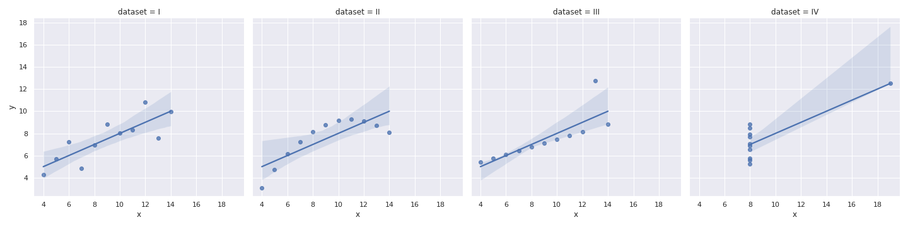

## Idioms For Statistics

Sometimes we have a statistical collection of samples-
* Many samples from a set of experiments
* many rows in a spreadsheet<br>

Each such sample may stand alone or be an entire time series.


Sometimes the values are inherently statistical-
* values that come with estimates and variances
* or parameter sets, each defining a statistical distribution


We can always plot the value with error bars, but that may not be adequate.
If possible we want to give more information, up to showing the entire
distribution.


## Anscombe's quartet

If someone hands us a bunch of x-y samples,
natural laziness pushes us in the direction of just doing the regression,
presenting the regression parameters, and declaring victory.

But sometimes this misses critical details.


Anscombe, F. J. (1973). "Graphs in Statistical Analysis".
American Statistician. 27 (1): 17&ndash;21. doi:10.1080/00031305.1973.10478966.
JSTOR 2682899.

There is a copy in the data directory for the course.


These are four datasets with identical (to 2 decimal places or better):
* mean of x and y
* variance of x and y
* correlation
* linear regression line
* $ R^2 $ of the linear regression


But they are very different.<br>
<span class='smalltext'>Anscombe.svg: Schutz, CC BY-SA 3.0, via Wikimedia Commons</span><br>
<span class='image60'></span>


See also the *Datasaurus Dozen*
<span class='image60'>[](https://www.autodesk.com/research/publications/same-stats-different-graphs)</span>


This sort of situation is what makes visualization such a critical tool for
scientists and data analysts.  Fortunately there are tools available that
will quickly generate very revealing graphics for this sort of data.  Seaborn
is one such tool.


## Let's get familiar with Seaborn

[Seaborn](https://seaborn.pydata.org/)
is another python plot library built on top of matplotlib.
It has *layered grammar of graphics* concepts in a Pythonic interface,
and some very nice features for statistical data.


```python
import pandas as pd
import seaborn as sns
anscombes_df = pd.read_csv('/path/to/data/anscombes_quartet.csv')
sns.set_theme()  # default theme
sns.lmplot(data=anscombes_df, x='x', y='y',
           col='dataset')
```



Seaborn's *lmplot* plots linear models.  In this case we see the regression
line and the standard deviation of the regression line- and that is a deep
enough anlysis that the differences between the datasets become visible.


## Seaborn's Tutorial is *Excellent*
We will walk through several sections in detail.  The other sections you
get to read as homework.

Please open up **seaborn_workbook_1.ipynb** .  The generic venv should work.


## Walking through some components
## Exploring Some Seaborn Features
Let's look at a demo notebook 

Some examples:
* multiple spreadsheet records
* multiple time series, like the California data or multiple reps of RHEA runs

Things like box plots and violin plots

How to read a box plot or a violin plot

How to draw one in matplotlib

Support in seaborn

Density estimation vs. simple histograms

clustering