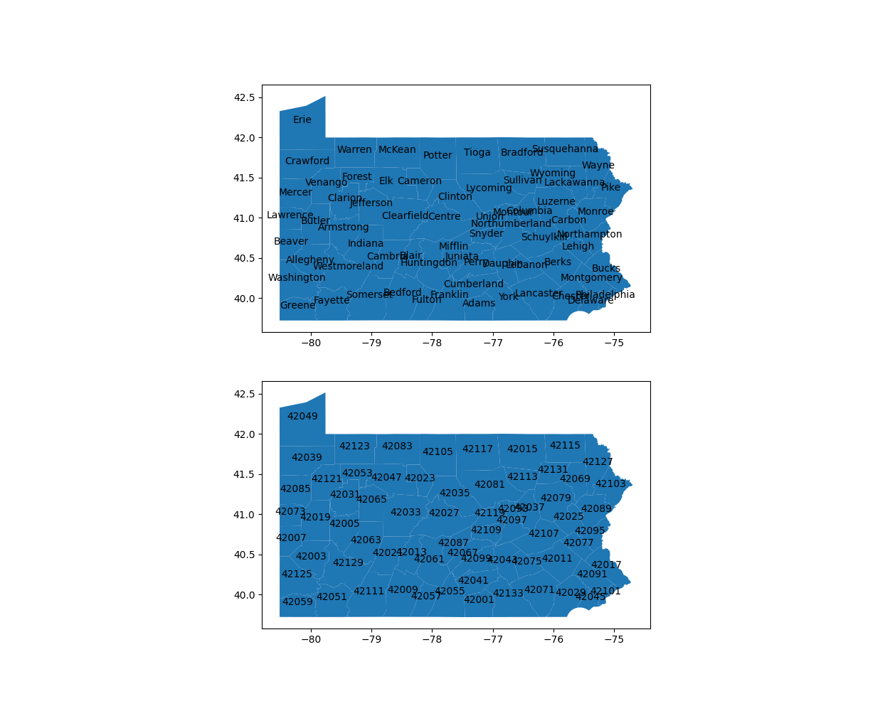
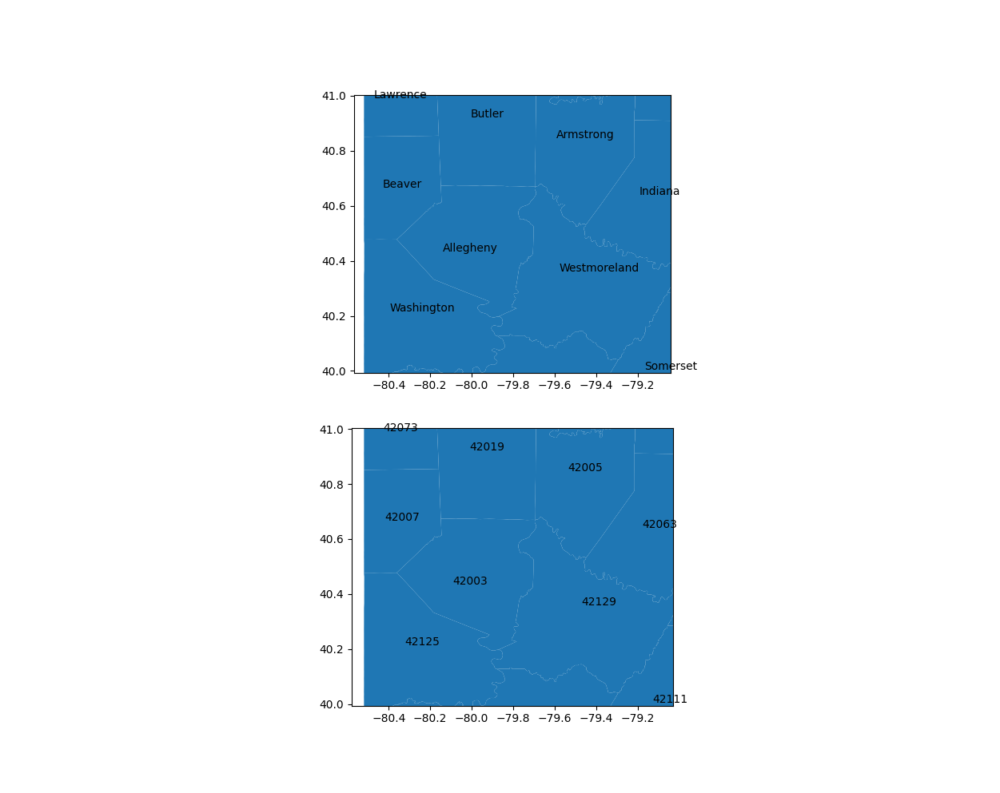
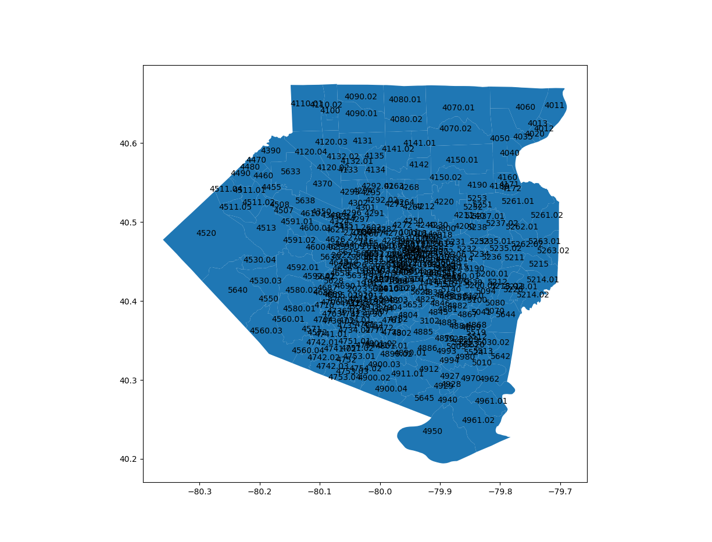
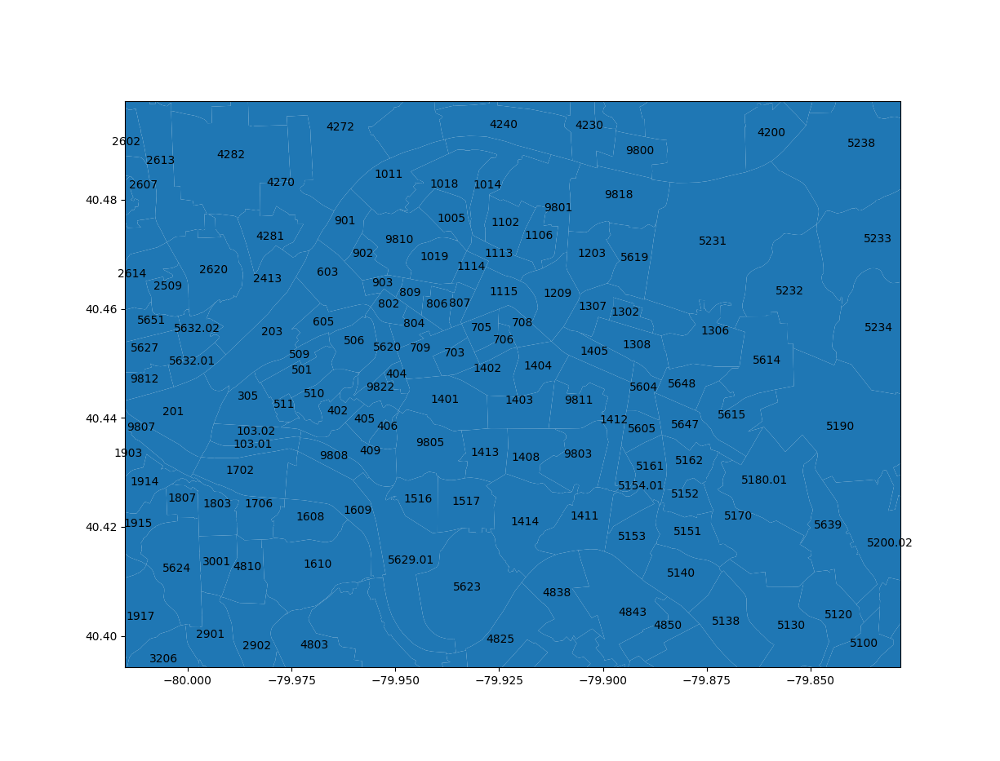
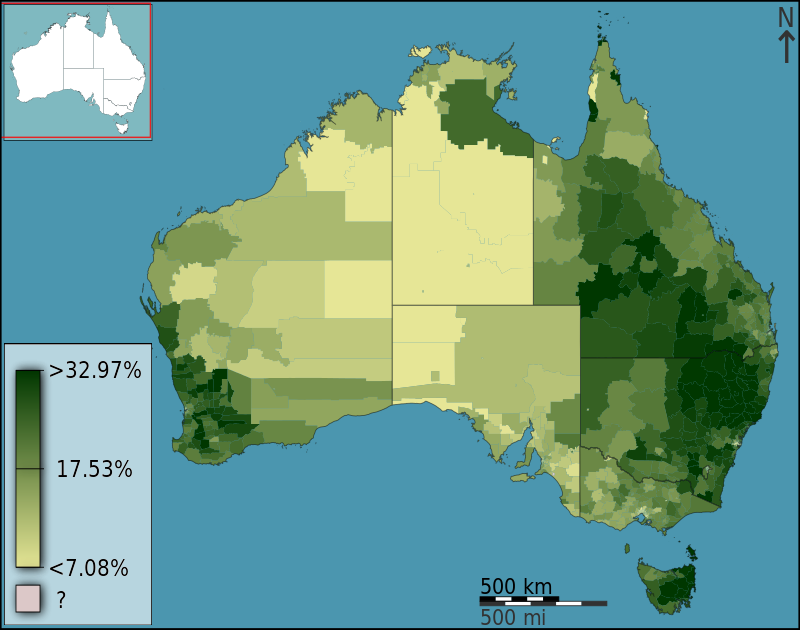

# Drawing Maps

Maps are datasets with a 2D continuous manifold, corresponding to, well,
a map.

Using just available data and simple tools, you can make some amazingly
insightful maps.


## Some possible fibers:
* snow depth: real and continuous
* measurements of snow depth: real and discrete
* names of counties: non-continuous scalars
* population: a different kind of non-continuous scalar
* time series, for example COVID cases: non-continuous in space,
  presumably continuous in time.


## To draw a map, you need:
* Geographical boundaries.  An amazing amount of this data is freely
available.
* A way to name the locations.  There are codes for this.  In the US they
are *FIPS codes* and *census tracts*.
* Software to do the necessary map projections.  We'll use GoePandas, but
there are many options.
* Something interesting to plot.


## Finding Geographical Boundary Data
There is a huge amount of data available.  Just google.  You probably want geojson
or shapefile data (extension .shp).

For all sorts of US data, try
[The US Census TIGER database](https://www.census.gov/cgi-bin/geo/shapefiles/index.php) .


I got this from that site. 42 means PA data (see below)
```
$ ls -al tl_2021_42_tract.zip
-rw-rw-r-- 1 welling welling 12851057 Mar  6 01:57 tl_2021_42_tract.zip
$ unzip tl_2021_42_tract.zip
Archive:  tl_2021_42_tract.zip
 extracting: tl_2021_42_tract.cpg    
  inflating: tl_2021_42_tract.dbf    
  inflating: tl_2021_42_tract.prj    
  inflating: tl_2021_42_tract.shp    
  inflating: tl_2021_42_tract.shp.ea.iso.xml  
  inflating: tl_2021_42_tract.shp.iso.xml  
  inflating: tl_2021_42_tract.shx    
$ ls -al tl_2021_42_tract.shp
-rwxrwxr-x 1 welling welling 20401380 Sep 15 22:47 tl_2021_42_tract.shp

```


**Caution:**  These files can be big!  They don't generally seem to be packaged in
such a way that you can load them over http, so you'll probably need to pick a place
on your local machine to store them.


**Caution:**  Don't commit them to gihub!  Because of their size, they really slow
down updates- for everyone using the repo.

<span class="smalltext">I've done that.  Don't repeat my mistakes.</span>


There are too many sources of geodata available to list.  Beyond govenment sites they are
less stable.  Expect language issues.

A lot of the data is map rasters, which is not exactly what we want here.

Some examples:
* [UK Open Geography Portal](https://geoportal.statistics.gov.uk/datasets) boundaries for Great Britain
* [EU Political Boundaries](https://ec.europa.eu/eurostat/web/gisco/geodata/reference-data/administrative-units-statistical-units/countries)

etc, etc, etc.


## Location Coding
Every state and county in the US has a FIPS code.  The acronym comes from
*Federal Information Processing Standards*.

Here is the [USDA table of County FIPS Codes](https://www.nrcs.usda.gov/wps/portal/nrcs/detail/national/home/?cid=nrcs143_013697) .  All of PA is two-digit code 42; Allegheny County is 42003.








Below FIPS codes come Census Tracts.  This map is from
[the TIGER database at Census.gov](https://www.census.gov/cgi-bin/geo/shapefiles/index.php?year=2021&layergroup=Census+Tracts) .






## GeoPandas

If you spend all your time handling geographic information, you probably want a full GIS
like [QGIS](https://www.qgis.org/en/site/).  But we are just visiting, so we will use something
more familiar.


[GeoPandas](geopandas.org) is Pandas, with a couple of additions:
* Geometry as a prominent data type
* Projections.  This is a huge topic.


If you load a shapefile into GeoPandas, it produces a *GeoDataFrame*. If you look at
one row of that GeoDataFrame it will contain a column named "geometry".  The entry in
that column will be of type [GeoSeries](https://geopandas.org/en/stable/docs/reference/geoseries.html) .
Let's take a look at all the methods...

If you call `GeoSeries.to_file()`, you will see it contains a shapefile and a lot of ancillary information.

(This is the common case.  There can be more than one column of geometry for example).


Given a GeoDataFrame, you can use standard Pandas operations to add columns with scalar values.
Then the `GeoDataFrame.plot()` method can display a map with coloring showing those scalars. Such
a map is called a *Choropleth* map.
<span class=image60>[](https://commons.wikimedia.org/wiki/File:Australian_Census_2011_demographic_map_-_Australia_by_SLA_-_BCP_field_2715_Christianity_Anglican_Persons.svg)</span>


## Projections

We are only going to scratch the surface of this.

The Earth is round. Maps are flat.  Map projections are how we handle the difference. "Think of it like
peeling an orange, then flattening the peel".


Projections have names, and identifying numbers.  We will look at a couple, but there
[are](https://proj.org/operations/projections/index.html)
[many](https://scitools.org.uk/cartopy/docs/latest/reference/projections.html)!

GeoPandas stores projections using [CRS](https://pyproj4.github.io/pyproj/stable/api/crs/crs.html) objects
from the [pyproj](https://github.com/pyproj4/pyproj) package.


The simplest projection is just
`$$ x = longitude$$`
`$$ y = latitude$$`
with the units of x and y being degrees.  This is the one
we have been using so far.  This projection has an official name, *Plate Carr&#233;e*.  It is also known by
its European Petroleum Survey Group (EPSG) number, 4326.


The *Plate Carr&#233;e* projection gives a world map that looks like this:  
[](https://en.wikipedia.org/wiki/Equirectangular_projection)


The Mercator projection (EPSG 3395) is also commonly used, and reduces distortion somewhat.
[](https://www.britannica.com/science/Mercator-projection)


You'll see [WGS84](https://en.wikipedia.org/wiki/World_Geodetic_System) mentioned in many descriptions
of projections.  This is usually a reference to the geoid, the not-quite spherical shape the Earth
would take if it were all water.  All of these coordinate systems are made with reference to the geoid.


Finally, let's consider the Orthographic or Local Tangential projection, a
very simple projection that you can compute in a few lines of Python code.

It works very well for small regions (like the size of California).


To implement the Local Tangential projection,
* Consider the Earth to be a perfect sphere.
* Imagine a plane tangent to the sphere at the center of the region of interest.
* Line up the X axis on the plane with the line of longitude that passes through the tangent point.
* The Y axis is now aligned with the line of longitude at that point.
* Project the points on the Earth's surface parallel to the radius vector at the tangent point.


<span class=tinytext>By Mike1024 - Based on en:File:EarthTangentialPlane.png by en:User:Raffyl99 (public domain), Public Domain, https://commons.wikimedia.org/w/index.php?curid=9510652</span>
[](https://en.wikipedia.org/wiki/Local_tangent_plane_coordinates)


So the projected region covers 1/2 of the globe, with the tangent point at the center.  The
lines of longitude and latitude are parallel to the X and Y axes at the tangent point, but
they don't stay that way.  At the tangent point, the map and the coordinates are very intuitive
and natural.


## Experiments

Now we try out GeoPandas using **geopandas_experiments.ipynb** .