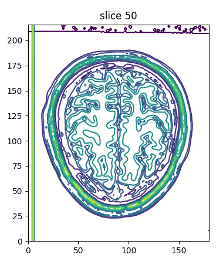
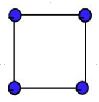
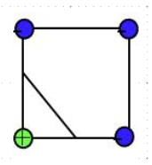
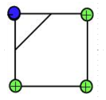
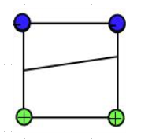
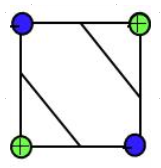
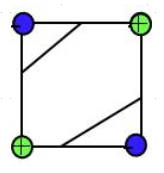
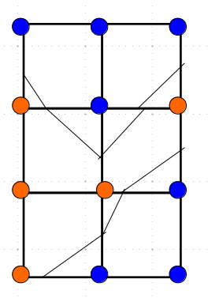
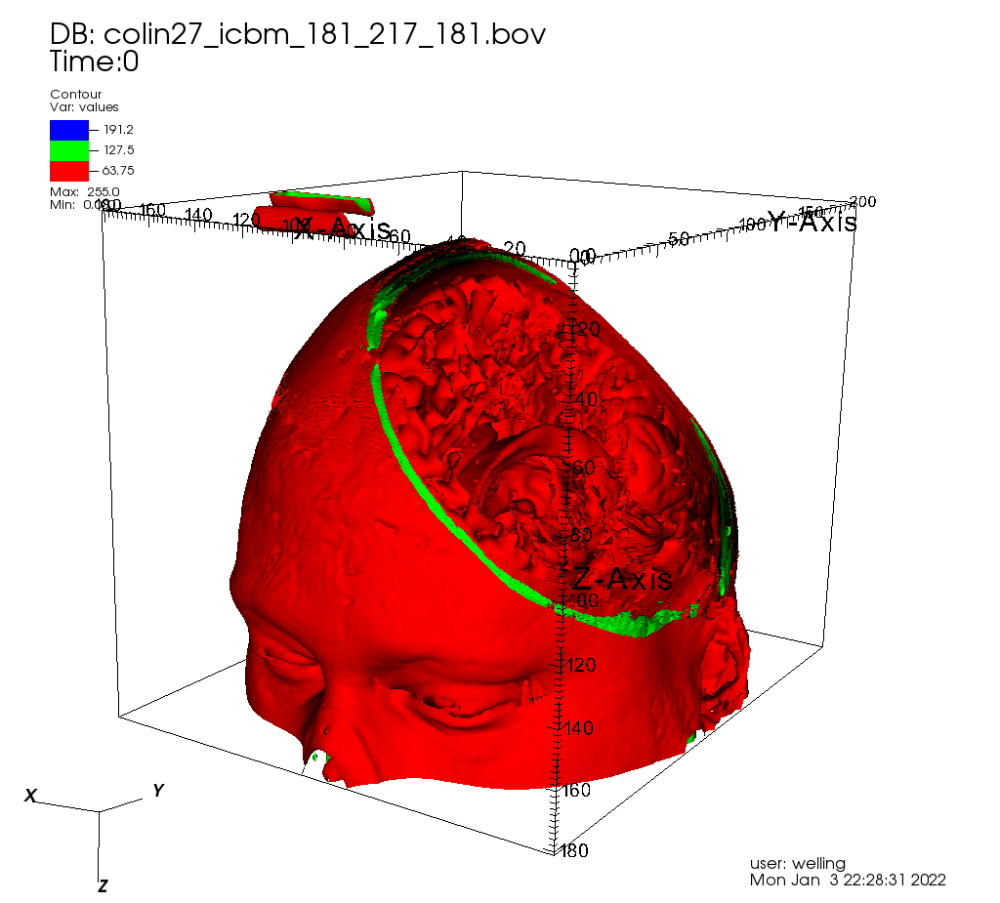

## Marching Squares: A Simple Visualization Algorithm

We looked at contour plots of Colin's brain:

## How is this generated?

There is a simple, elegant algorithm for drawing contour plots of
gridded data: *Marching Squares*.  Let's look at the algorithm for
drawing a single curve, which would be drawn in a single color in this
figure.

## A curve at a single field value is a Constant Value Surface.

This case is 2D, but the 3D case is also ubiquitous.

The color is chosen from a _color table_, by looking up the contour
value and mapping it to an RGB triple.

## One Square At A Time

Consider that the data comprises some function f(x,y), where sample values
are known on a grid.  We want to draw curves of constand f.  Call that value $f_0$.

Any given grid square has four corners.  Each corner has a value that
is either above or below our target value $f_0$.  Since there are 4
corners, there are $2^4 = 16$ possible combinations of corners being
above or below $f_0$.  Treat the exact matches as being below by some
tiny amount.

## Finding The Intersections

Suppose we find an edge for which one corner is above $f_0$ and the other is below.  Because the function is continuous, there must exist a point on the edge for which $f=f_0$.

We can estimate a location for the point by simple linear interpolation.

## Case 1: All Corners Are Either Above Or Below

There are no intersection points, and the curve does not cross the cell.

There are two cases like this: all - and all +.

## Case 2: One Corner Different

If 3 of the 4 corners are on the same side of the isovalue, there is
one line segment in the cell.

Each of these 2 cases has 4 variants (rotations).

## Case 3: 2 by 2

If two corners are inside and 2 are outside, the matched corners can be
adjacent or diagonally opposite each other.

If adjacent, you get this case (with 4 possible rotational variants).

## Case 4: 2 by 2 on opposite corners

This one has only 2 rotational variants.

But there is an ambiguity about where to put the lines.  You can use either of
these two rules, but you have to be consistent!

## Summarizing the Cases

So there are:
* 2 times 1 cases of Rule 1
* 2 times 4 cases of Rule 2
* 1 times 4 caess of Rule 3
* 1 times 2 cases of Rule 4 (whichever you pick)
16 cases total, as expected.

## Putting Cells Together

When you join the edges, you get contour lines!

You can use higher order (spline) interpolation for a smoother appearance.

## The 3D version is called Marching Cubes

it has $$2^8 = 256$$ cases.  Here's Colin's brain in 3D, as generated
by VisIt.  We'll do more of this when we get to 3D vis.

