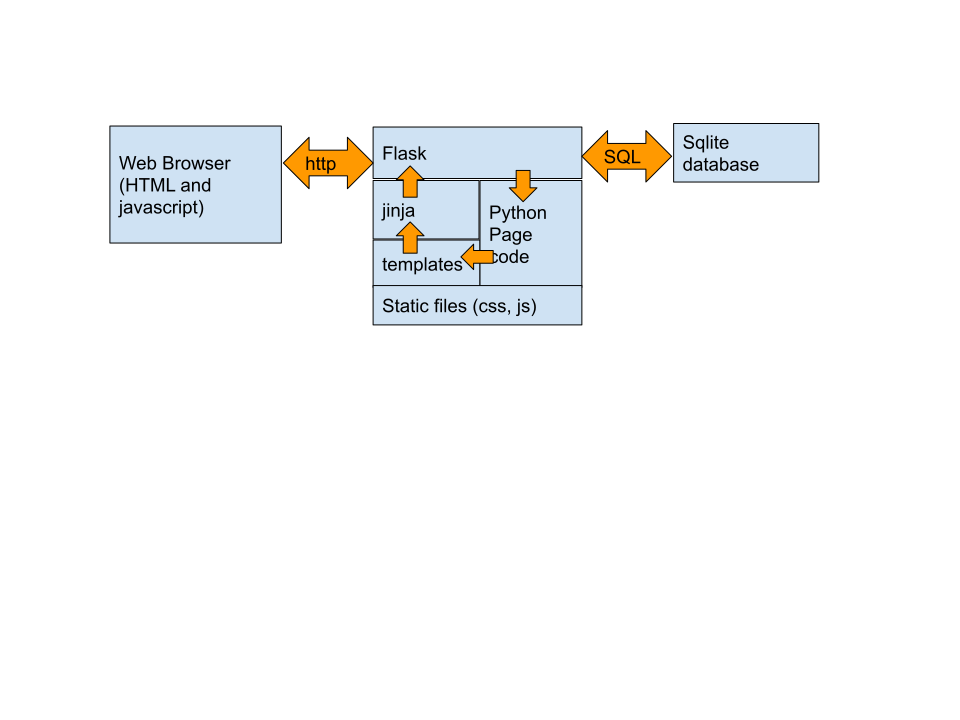
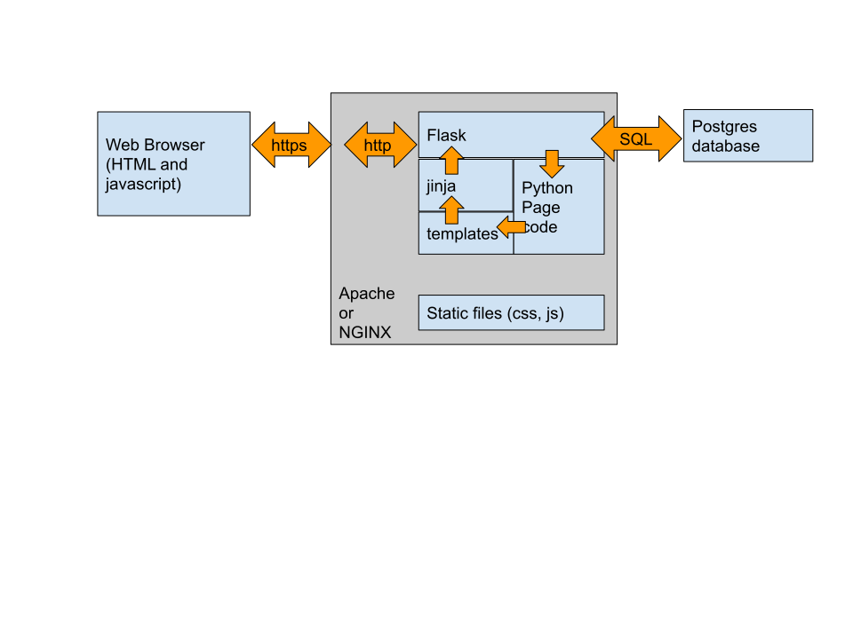
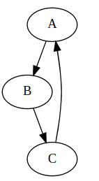

## Now We Need A Web Server ##

In class, most visualization (and practically everything else!) takes
place in Jupyter Notebooks.

In the real world, most visualization (and practically everything else) takes
place in a web browser.

We've reached the point where we need to look at tools beyond Jupyter.


Please note that you are not expected to fully understand this web server.
This is a visualization course, not a full stack web infrastructure course!
So don't worry, and just try to understand what information is going where.

The goal is to learn to produce a visualization that will be served by a
web server, not to be able to produce the web server itself.


## What We Will Set Up

We are going to start a program on our local machines that runs outside of a
notebook, and that responds to requests sent via http by sending web pages
with visualizations on them.


This is only a subset of how a real web server works, but it is enough to
try out some tools.  Also, it's important to know what is really happening
behind the scenes in any real modern application.


There is no magic, no Cloud, no such thing as a "web site"- only other
people's computers, running code like your code.


## Streamlit and Flask

There are actually two examples of web servers here, written in
* [Flask](https://flask.palletsprojects.com/en/2.3.x/), a very pythonic, full-featured server
* [Streamlit](https://streamlit.io/), which does much of the work for you, whether you like it or not.

There are others, like [Django](https://www.djangoproject.com/)) , which is a larger, more complex framework.
Lots of web pages are now written in [React](https://react.dev/) .  Jupyter Notebook is itself partly a web server.


Definitely clone the class Streamlit repo, which is
[CMU-MS-DAS-Vis-Streamlit](https://github.com/jswelling/CMU-MS-DAS-Vis-Streamlit) .  We want to run it
today, and use it to draw GraphViz graphs.


The class Flask repo is [CMU-MS-DAS-Vis-Flask](https://github.com/jswelling/CMU-MS-DAS-Vis-Flask) .  Clone
and run it if you are interested; it will be used in class for examples.


## Streamlit Installation Steps (for Linux)

```
git clone https://github.com/jswelling/CMU-MS-DAS-Vis-Streamlit
cd CMU-MS-DAS-Vis-Streamlit
conda create -n streamlitEnv python=3.10 pip
source activate streamlitEnv
pip install -r requirements.txt
```


## Flask Installation Steps (for Linux)

```
git clone https://github.com/jswelling/CMU-MS-DAS-Vis-Flask
cd CMU-MS-DAS-Vis-Flask
conda create -n flaskEnv python=3.10 pip
source activate flaskEnv
pip install -r requirements.txt
git checkout d3_support  # to get all the features
bash init_db.sh
bash run_app.sh
```


## What Web Servers Do

Streamlit hides most of this, but it is still happening.  With Flask,
all the parts are visible.



You are running the server on your own local machine, and it should
not be visible from any other machine.  It is in developer mode and
has almost no security.  **Never run this server in public unless you
have fixed the security issues.**


Unfortunately the details of the security issues are beyond the scope
of this course.  Flask, having a real SECRET_KEY is necessary.  One must
guarding against false inputs (SQL injection).  


## A More Complete Environment
 



We would need a real web server, because Flask or Streamlit alone is too slow for
real traffic.  Flask or Streamlit can then run in a Python environment within that
webserver.
* [Apache](https://httpd.apache.org/)
* [NGINX](https://docs.nginx.com/nginx/admin-guide/installing-nginx/installing-nginx-open-source/)


We would need https support.  A real web server would provide that,
and automatically translate to the http which our server speaks.


We would need a real database. We have a tiny one based on Sqlite, but
for a serious project we would want a full-sized SQL database like:
* [MySQL](https://www.mysql.com/)
* [PostgreSQL](https://www.postgresql.org/)


We would need session management.
* In Flask: There is really no state to the sessions we have now; the visualization is completely recreated every
  time we click 'Submit'.  A real session would allow things to be
  remembered between page views.  Flask has plug-ins for that.
* In Streamlit: The model is that the Python program completely re-runs every time the page gets updated.  One has
  to manage session state by using st.session_state .  It gets awkward.


We would need better login management.  Users should provide email
addresses and those should be verified, for example.  Flask and
Steamlit both have plug-ins to help with this.


## Exploring the Streamlit Version

There are actually two separate web servers here:
* _curveserver.py_ , the current demo
* _graphserver.py_ , for GraphViz later

Streamlit can only handle one-page websites, so they have to be separate.


## Start up the curveserver:
Starting in your clone of CMU-MS-DAS-Vis-Streamlit:
```
cd src/webserver
conda activate streamlitEnv
streamlit run curveserver.py
```
That's it; streamlit does the rest!  Now open http://localhost:8501/ and
you should see your web page.


## The code is really simple.
```
def draw_matplotlib_figure(fig, axes, label="",
                           spines=True, log_scale=False):
```
This is a standard matplotlib routine that draws into a given figure
and set of axes.  Anything based on matplotlib, like plotnine or
seaborn, would also work.


```
svg_write(svg_string, center=True)
```
Given a string of Scalable Vector Graphics code representing a figure,
this function just draws it on the Streamlit page using the standard
_st.write()_ method.  It takes a few tricks but it works.


The `main()` routine draws the page.

It executes straight down, top to bottom.  You can see everything on the
page get created.  This is really nice for simple pages, and really annoying
when you want to add complexity.

This bit grabs the image back from the Figure as SVG and sends it to the page:
```
    image_holder = StringIO()
    FigureCanvasSVG(fig).print_svg(image_holder)
    svg_write(image_holder.getvalue())
```


## Exploring The Flask Version

The application follows this [Flask Tutorial](https://flask.palletsprojects.com/en/2.0.x/tutorial/) very closely, except that:
* We are only creating the index page and the necessary code to
  define the user.  Thus all reference to blog posts has been
  stripped out.
* The name of the app has changed from **Flaskr** to **MyProj**.
* There are no more blog posts, so the index page is now provided
  by *main.py* and *index.html*


The stuff in ```{{ }}``` and etc. is
[jinja templating](https://jinja.palletsprojects.com/en/3.0.x/).  Remember
that it is evaluated *at the server*, using information provided in
the ```render_template()``` call.

You can see the rendered version in the Developer Tools source view.  By the
time it reaches the web browser, it has been converted to standard HTML.


It is jinja templating that lets us implement a 'standard' page using the
*base.html* template.  This functionality is very flexible and could be
expanded *a lot*, but for now let's keep it fairly simple.


The stuff in the ```<script>...</script>``` blocks is javascript.  We use
one standard javascript library, [jQuery](https://jquery.com/) , for
convenience.  There is also some custom javascript to handle some individual
pages.

The trick to remember about jQuery is that we can use the expression
```
$("#somename")
```
to find and access an HTML element with the id string "somename".


Javascript code actually executes in the browser, and controls all behavior
beyond just displaying standard HTML.  For example, it is javascript code
that allows us to use the
[AJAX operation](https://www.w3schools.com/whatis/whatis_ajax.asp)
that generates the matplotlib plot.


## In-Class Exercises

Add a Streamlit *checkbox* to control the presence of a legend.  Yes, this
could have been used instead of the *radio* widgets in the existing page.

Change the radio buttons that control the presence of the upper axis lines
to a checkbox instead.

Change the code so that a Streamlit *selectbox* can control the line style- a line,
points only, or the line plus points.


# Let's Test GraphViz

If you have installed GraphViz correctly, the following command should work:
```
$ dot -V
dot - graphviz version 2.43.0 (0)
```
That is, the `dot` command should be able to execute and print its version number.


Check that this works *in the window where you have been running streamlit* .
If it does, we are ready to start graphserver in that window.  If not, we
probably have to fix your $PATH environment.


Kill the streamlit process that is running curveserver.py, and instead run:
```
streamlit run graphserver.py
```
It may take a minute to get your web browser to recognize that the page has
vanished and come back different.


Once the _Graph Renderer_ appears, find the window marked 'Dot Language To Render'.
Enter:
```
digraph { A->B->C->A }
```
and press control-Enter. Does a graph with nodes and edges appear?



