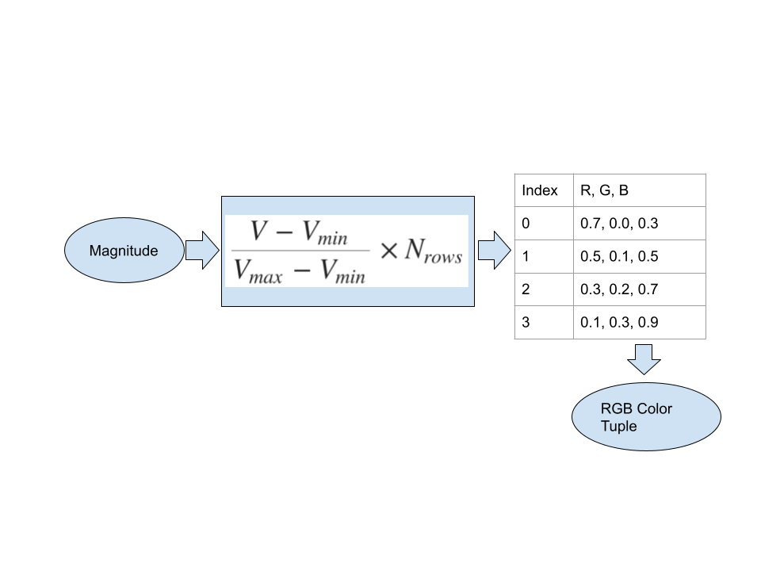
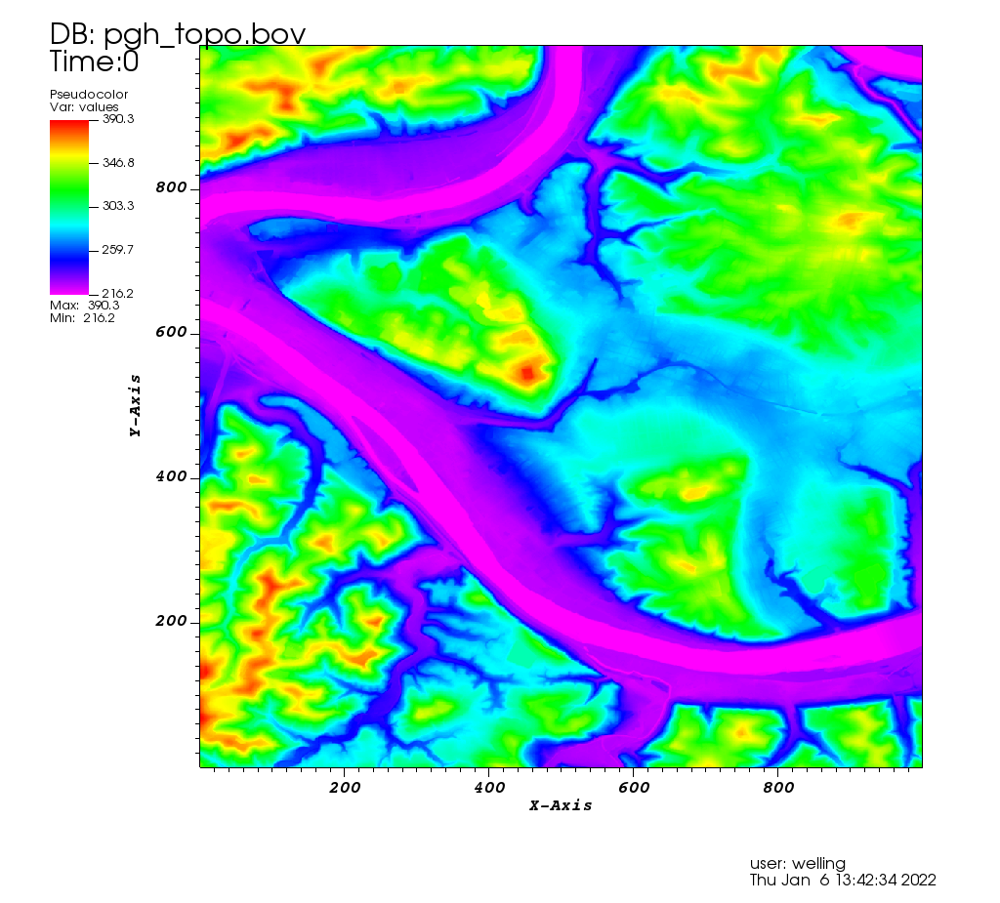
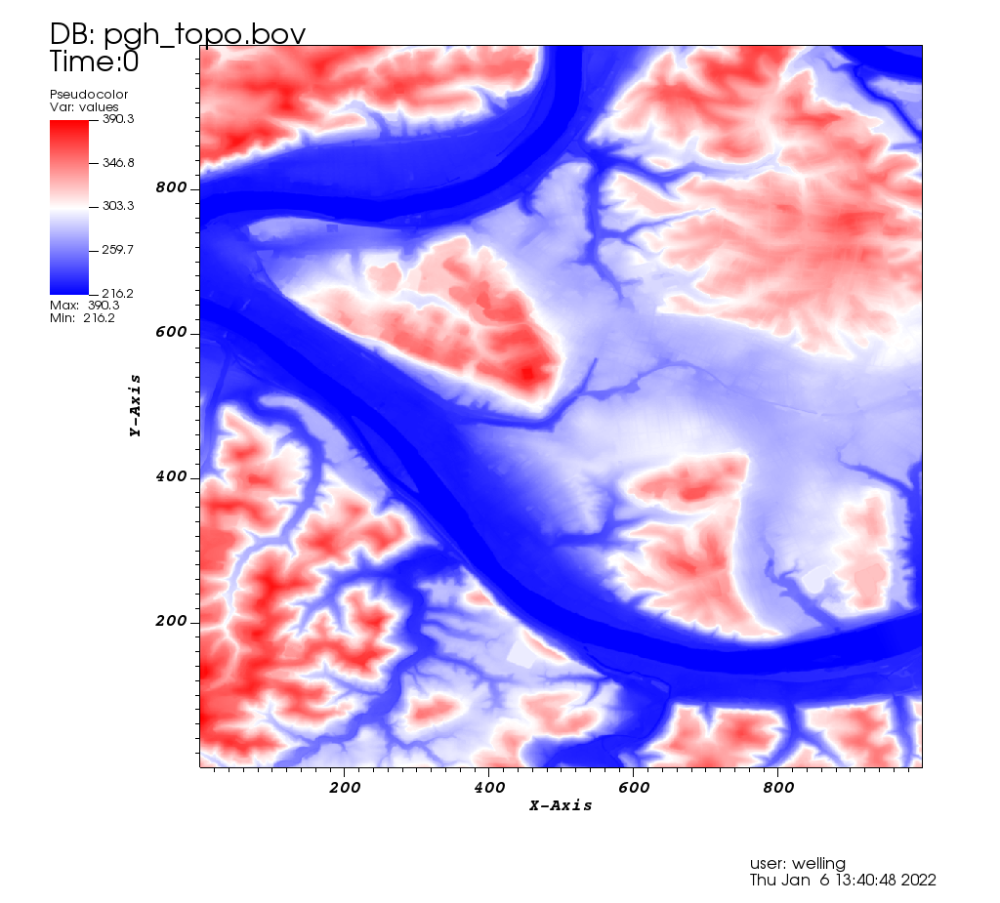
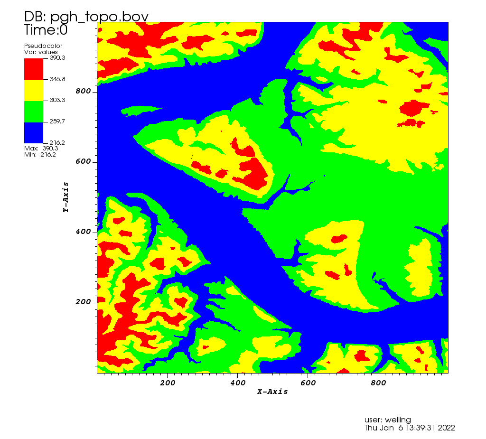
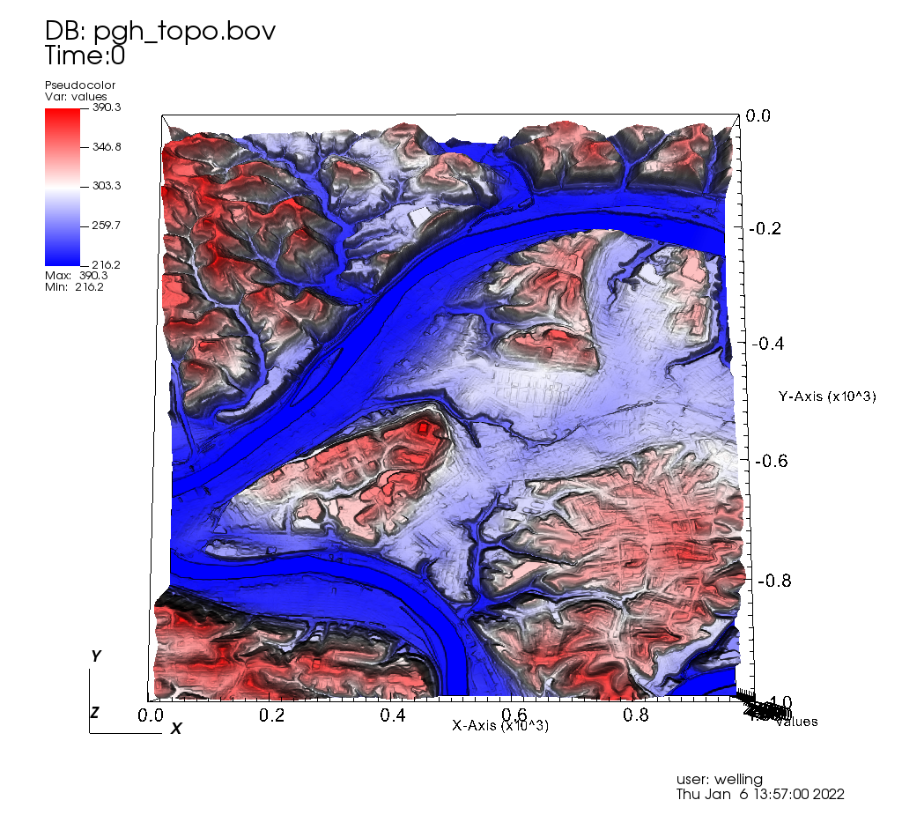
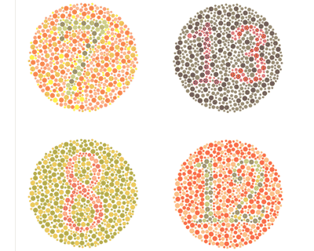
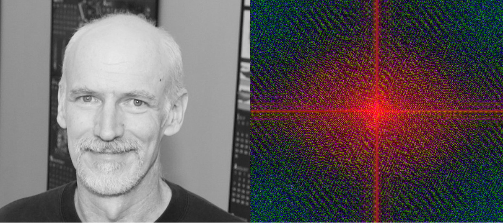

# Using Color: Important But Tricky

## How Do We Use Color?

* Distinguishing categories- this is safe as long as the colors are
  distinguishable.
* Conveying magnitude information.
  * In combination with a color map.
  * Very sensitive to color perception deficits.
* Drawing attention to salient details.  This is dangerous- the same
data can look very different with a different color map.
* Color maps can make contour lines!

## What is a colormap exactly?

A colormap is just a lookup table.  It takes a magnitude, scales it into
the table range, and looks up and returns a RGB (or RGBA) value.

## Texture Maps are different.

In texture mapping, a full-color image is 'mapped' onto the face of a
polygon.  This is tremendously useful, since it can show fine details
with a coarse polygon mesh.  But it's much trickier than simple colormaps.

It's commonly done in the context of 3D graphics.

## Texture Map Example

## Same Data, Different Colors

### Rainbow

### Viridis

### Difference is designed to show variation from the central value

### Contoured (like a contour plot)

This is actually an elevation map of Pittsburgh

## Color perception is highly variable

 
Ishihara test image, American Academy of Opthalmology

## The mechanics

The retina contains rods and cones.  The rods mostly detect
brightness, but the cones come in multiple types and detect color.
Here are the nominal response curves:

When the M and L pigments have variations which reduce their
separation, or when one is missing entirely, the ability to
distinguish red and green is lost.

This is much more common in men (I think because it is encoded on the
X chromosome).

## Dr. Barber's Discussion of Color Blindness In Simple Graphics

[What Does Color Blindness Look Like?](https://youtu.be/DpkWgAyjWBs)

## Using Color To Show Complex Values

One more useful trick with a color table- suppose you want to show a
continuous field of complex values?  This representation is not intuitive,
but sometimes it is useful.

Any complex number $z = x + iy$ can also be written in a polar
representation, $z = r e^{i \theta}$, where $0 \le \theta < 2\pi$ .  Normalize
the data so that $r \le 1$.

This corresponds to a point on the unit circle.  The "color wheel" also
forms a unit circle.  So each complex value corrsponds to a unique color
in this color space.

Colors of Value=1 in the HSV Color Space

(This is actually the log of the complex modulus)
