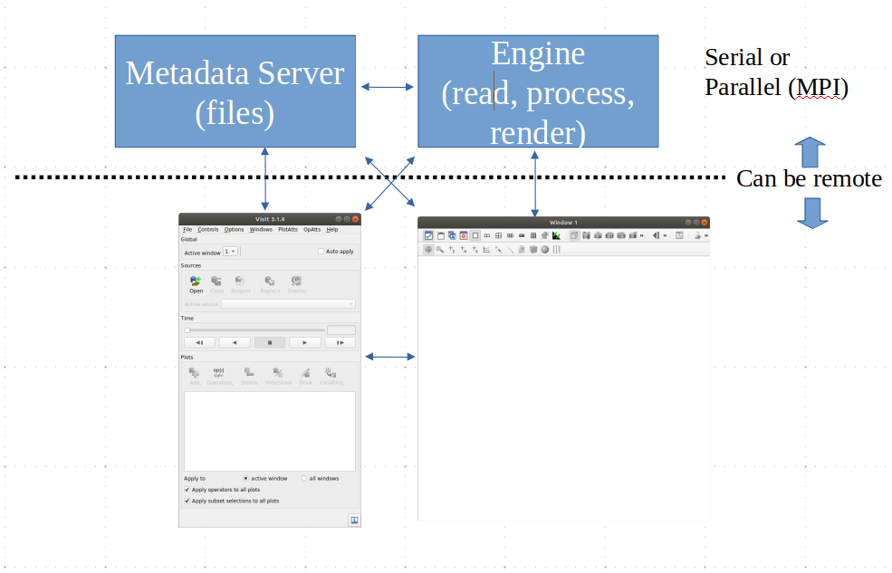
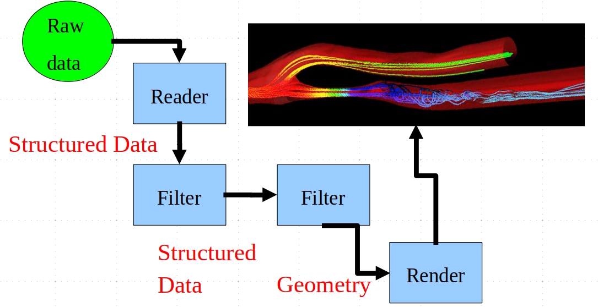

# VisIt: A Tool For Scientific Visualization


### Why Is Scientific Visualization Different?

In physical sciences, data (usually) exists in 3D space and changes over time.
We'd say this is a 3D-plus-time *manifold*.

Quantities are fully differentiable.  If you know a value at two or more
points, you can make a good guess at the values in between.


Quantities at points (the *fibers*) may be more complex.
* Multiple scalars- pressure, temperature, etc.
* Literally complex, as in complex numbers
* Vectors.  Actual vector quantities almost never appear in the sorts of visualizations we've seen so far.
* Tensors.  The audience for the visualizations we've seen so far don't even know what those are.


Quantities are governed by physical laws, like:
* conservation of energy and momentum
* entropy increases over time
* etc.

Users may be more sophisticated.  They've fully internalized these laws, and
visualizations that violate them will look "wrong".


This all leads to new, specific *idioms*.

And it leads to visualizations that are useful for experts but
confusing for lay people.


### Some Comments on Perceiving Natural Phenomena

Let's watch a video.  This is from Siggraph 1989, showing the
then state-of-the-art scientific visualization of a thunderstorm
simulation from NCAR.  The animation work was done at NCSA.


[Study of a Numerically Modeled Severe Storm](https://mediaspace.illinois.edu/media/Study+of+%20a+Numerically+Modeled+Severe+Storm/1_dnby2rlw)


Things to note:
* This was not made with VisIt.  VisIt didn't exist at the time- it was made
with state-of-the-art animation software originally created to do TV
commercials and movies.
* The supercomputer simulation would run pretty comfortably on your phone.


The animation is clear about what is simulation and what is real.  This is a
big deal, because simulation results can look very natural and thus viewers
can be confused.

The animation is very clear about motion and scale, with a moving grid to
keep the viewer oriented.


But it is not very clear about the limitations of the simulation.
* The boundary of the "cloud" is arbitrary.
* The computational resolution is much lower than it looks.
* There is no tornado in the simulation- the resolution is way too low for it.


One point here is that there is a conflict between scientific visualization
made for scientists and those made for the lay public.
* Scientists love detail and have probably learned the idioms necessary to convey it.
* Lay people will recognize physical-looking behavior and assume the visualization represents reality.


### The Large Scientific Visualization Tools

These are large software applications that:
* Read data (in some known format)
* Filter the data
* Transform the data into geometry
* Interactively display the geometry


You can also record animations for later display.  There are features
for infovis as well, but they are not the emphasis.


The big names among these tools are:
* [VisIt](https://visit-dav.github.io/visit-website/) - which we will use
* [ParaView](https://www.paraview.org/)

Both were developed at the US National Laboratories.  ParaView was developed
under contract with [Kitware](https://www.kitware.com/), an open source
company.<br>
<span class='smalltext'>They give you the software, but they sell you the documentation.</span>


#### VisIt and ParaView are very similar internally

Both are based on [VTK](https://vtk.org/) .

Both provide Python scripting.

They may eventually merge.  Or not.


### VTK is the Visualization Toolkit

VTK provides:
* a set of software objects that plug together to form a dataflow pipeline.
* APIs for combining them in C++, tcl, python, etc.

Maintainers are [Kitware](https://www.kitware.com/), the same folks who
created ParaView.  Many of the algorithms come from early research in
scientific visualization at IBM.


If you want it, just
```
pip install vtk
```
But you won't get parallelism, and you won't get some tools.


### Components of VisIt




Imagine a set of modules connected by pipes.
* Start with one or more modules that read data.
* Add some modules that transform it.
* Ultimately, produce computer graphic geometry...
* and send it to a renderer.

Data -> (filter) -> (filter) -> geometry -> picture

In the end, you get a pipeline.  Data goes in one end, and pictures
come out the other.


Caveat: this is really a 'pull' pipeline.

Upstream parts that don't need to get recomputed each frame, aren't.


There is an older vis tool called OpenDX that actually looks like this.



### Demo!

