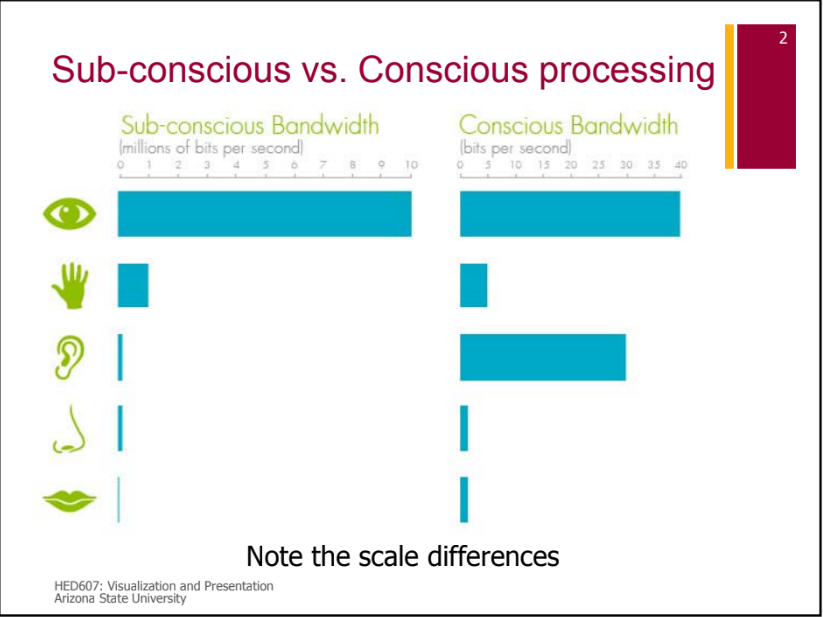
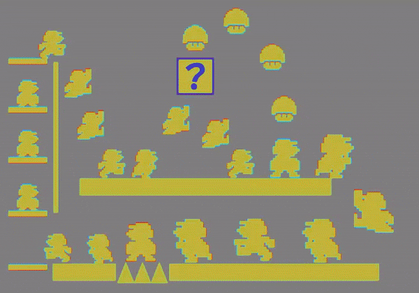
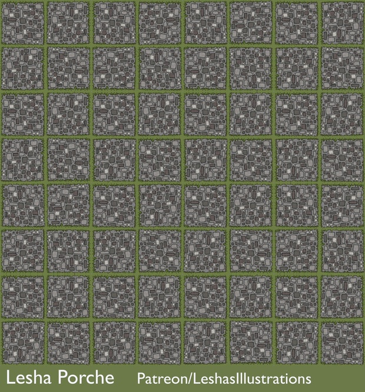
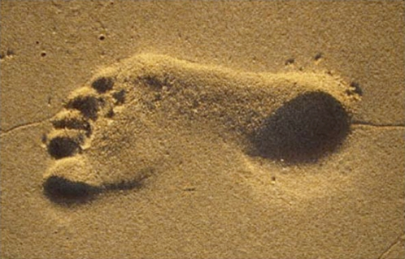

## Visualization and the Brain ##

Why do we use visualization?  Because we'd be fools not to.  The human
visual processing system is *amazing*!

 
<a href="https://commons.wikimedia.org/wiki/File:Human_visual_pathway.svg">Miquel Perello Nieto</a>, <a href="https://creativecommons.org/licenses/by-sa/4.0">CC BY-SA 4.0</a>, via Wikimedia Commons

 
<a href="https://commons.wikimedia.org/wiki/File:Comprehensive_List_of_Relevant_Pathways_for_the_Visual_System.png">XenusG</a>, <a href="https://creativecommons.org/licenses/by-sa/4.0">CC BY-SA 4.0</a>, via Wikimedia Commons

## The Standard System Provides...

* Three color channels at ~12 bits color depth
* Texture recognition
* Feature and pattern detection
* Motion detection
* Integrative detection of special features
* 3D reconstruction from parallax, motion, lighting, and transparency cues

All of this happens in V2 and below, I think.

The visual system is by far the best way to get large amounts of data
into someone's brain.

__Credit where credit is due:__ much of this lecture, including a whole
video appearing below, was created by Rebecca Barber of the Mary Lou
Fulton Teacher's College at Arizona State University.

## Example: Motion Illusions

 None of the marios in this image are actually moving.

There is a very good discussion of this illusion on
[Jacob Yates' vision blog](https://jake.vision/blog/motion-illusions).  It
mainly refers to a paper by
[Adelson and Bergen](http://persci.mit.edu/pub_pdfs/spatio85.pdf) from 1984
describing the "motion energy model".

There are neurons in the primary visual cortex that appear to implement
this model.  The calculation is simple and easy to implement using neural
networks.

The big point here is that you cannot help but percieve the
motion. Even when you know there is no actual motion, you still see
it.  This calculation is taking place during preconscious processing,
and its output is being sent to "you" as input.

Another example- Curved Line Illusion

I don't have a complete explanation for this one, except that the green
lines are picking up "curvature" from faint brightness patterns in the
gray "neighborhoods".  The patterns span the green lines.  The visual
system detects curvature in the patterns and incorrectly attributes it
to the green lines.

Note the foveal effect.  The green lines appear straight
out to the edge of foveal vision.

## Stereo vision and correlating stereo pairs

We get our sense of 3D from multiple cues:
* stereo parallax
* motion parallax
* focal depth of field
* perspective
* lighting cues

Different people weight these cues differently.

James Miller of the University of Kansas has a nice short discussion in
the context of parallel projection for graphics:
[James Miller depth cues intro](https://people.eecs.ku.edu/~jrmiller/Stereo/Section_01/Page_0010.php)

This is a footprint lighted from below

 The visual system makes a built-in assumption about lighting from above.

Can anyone not see 3D in 3D movies?

Stereocorrelation is a very compute-intensive task, but we do it instantly.
I have a story about moving point clouds in 3D.

[Rebecca Barber talk on Preattentive Perception](https://www.youtube.com/watch?v=W9SMQihwZwk)

